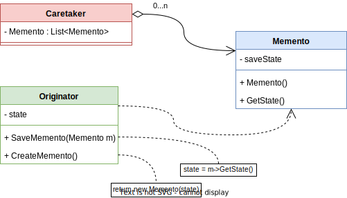

# Patrón Memento o Patrón Token

**Estudiantes**:

- Julio Rodroguez Salguera C16717
- Geancarlo Rivera Hernández C06516

## Tabla de Contenidos

- [Patrón Memento o Patrón Token](#patrón-memento-o-patrón-token)
  - [Tabla de Contenidos](#tabla-de-contenidos)
  - [Problema](#problema)
  - [Solución](#solución)
  - [Ejemplo de código](#ejemplo-de-código)
  - [Consecuencias](#consecuencias)
  - [Implementación](#implementación)
  - [Relación con otros patrones](#relación-con-otros-patrones)
  - [Relación con principios de diseño](#relación-con-principios-de-diseño)
  - [Referencias](#referencias)
  - [Anexo](#anexo)

***

## Problema

El patrón Memento es muy útil cuando se necesita preservar el estado de un objeto, componente o sistema sin comprometer su encapsulación. Es decir, el patrón Memento se utiliza para restaurar un objeto a un estado anterior, lo que resulta muy beneficioso para corregir errores o implementar un historial de versiones. Una característica importante de este patrón es que protege la encapsulación de los objetos, ya que la interfaz para modificar el estado guardado solo puede ser accedida por la clase que lo creó, siendo inaccesible y opaca para las demás clases.

Este patrón es especialmente útil cuando se necesita recordar y restaurar el estado de un objeto en un momento específico. Imaginemos que estamos trabajando en una aplicación y deseamos implementar la función "deshacer". En lugar de guardar múltiples copias del estado actual, el patrón Memento permite almacenar solo ciertos estados de un objeto "Originator" en estructuras llamadas "Memento".

Un ejemplo interesante que ilustra el uso del patrón Memento se encuentra en la plataforma de Correo Institucional de la Universidad de Costa Rica. Al redactar un correo, existe la posibilidad de volver al estado previo al presionar la combinación de teclas "Ctrl + z". Por ejemplo, es posible regresar del texto "Buenas tardes profesor!" (**Figura 1**) al texto previo "Buenas tardes" (**Figura 2**), que fue el último estado almacenado gracias al patrón Memento.

FIGURA 1: Estado actual del correo (Captura del Corre Universidad de Costa Rica)

FIGURA 2: Estado anterior del correo

FIGURA 3: Estado inicial del correo

Además, en el sistema de Correo Institucional, no solo es posible regresar al estado anterior al actual, sino que también se tiene la opción de regresar al estado inicial del correo si se continúa utilizando la acción "Ctrl + z" (**Figura 3**) de manera consecutiva. Esto permite retroceder y restaurar el texto al punto en el que se comenzó a redactar el correo.

[Volver al índice](#tabla-de-contenidos)
***

## Solución

El patrón Memento utiliza y se basa en tres componentes principales para definir e implementar su estructura, que pueden ser observados en el diagrama UML de la **Figura 4**:

FIGURA 4: Diagrama UML del patrón de comportamiento Memento

**Memento**
La clase Memento es responsable de almacenar la información del estado en un momento específico del componente *Originator*, conocido comúnmente como *snapshot*. Contiene toda la información necesaria para restaurar versiones anteriores de manera precisa. Estos objetos Memento se guardan en una estructura de datos en el componente *Caretaker*. Es importante destacar que el acceso a los datos del Memento se limitan únicamente al componente *Originator*, ya que éste utiliza los datos para recuperar estados anteriores (Haythornwaite, 2002, p. 285).

**Originator**
El Originator es la clase de la cual se toma el *snapshot* que se almacena en los objetos *Memento*. Es el componente que contiene el estado actual del sistema y utiliza objetos *Memento* para recuperar estados anteriores (Haythornwaite, 2002, p. 165). Esta clase interactúa directamente con los objetos *Memento*, ya que necesita leer su contenido para restaurar sus datos.

**Caretaker**
El Caretaker es el componente encargado de almacenar los *snapshots*, es decir, los objetos *Memento*. También es responsable de implementar las interfaces que permiten al cliente indicar a la clase *Originator* guardar el estado actual o volver a un estado anterior específico. Este componente no interactúa directamente con los objetos Memento ni puede acceder a su información, simplemente los almacena (Haythornwaite, 2002, p. 165).

**Interacción entre los componentes**
En el patrón Memento, los componentes interactúan de la siguiente manera: el cliente por medio de la interfaz Caretaker solicita al Originator guardar su estado actual, por lo que el Originator crea un nuevo objeto Memento y se lo devuelve al Caretaker para que lo almacene. Cuando el cliente solicita volver a un estado anterior, el Caretaker proporciona al Originator el estado deseado que está almacenado en el Memento. El Originator toma el *snapshot* del estado y lo aplica, volviendo al estado previo. Esto permite ocultar la implementación y los datos del Memento y del Originator a clases externas.

[Volver al índice](#tabla-de-contenidos)
***

## Ejemplo de código

Si desea comprender con mayor profundad el funcionamiento del patrón Memento y cómo implementarlo en un sistema, puede observar el código de ejemplo que se encuentra en la carpeta "src", la cuál contiene un ejemplo de guardado de estados del Correo Institucional de la Universidad de Costa Rica utilizando el patrón Memento.
Puede visitar el main del este código en este [link](./src/Main.java).

[Volver al índice](#tabla-de-contenidos)
***

## Consecuencias

Según lo expuesto por Haythornwaite (2002), el patrón Memento conlleva las siguientes consecuencias:

- **Preservación de la encapsulación:** El uso de la clase Memento garantiza que solo el Originator tenga acceso a la información que debe manejar, al mismo tiempo que se almacena fuera de él. Esto protege a otros objetos de interactuar con la complejidad interna del Originator y mantiene los límites de la encapsulación.

- **Simplificación del Originator:** En comparación con otros diseños que también preservan la encapsulación, el patrón Memento simplifica al Originator. En lugar de que el Originator tenga que mantener las versiones del estado interno solicitadas por los clientes, permite que los clientes administren el estado que necesitan por medio del Caretaker. Esto evita la carga de almacenamiento y gestión en el Originator y elimina la necesidad de que los clientes notifiquen al Originator cuando han terminado.

- **Posibles costos asociados con el uso de Mementos:** El uso de Mementos puede generar una sobrecarga considerable en ciertos casos. Por ejemplo, si el Originator necesita copiar grandes cantidades de información para almacenar en el Memento, o si los clientes crean y devuelven Mementos con mucha frecuencia al Originator. Por lo tanto, en situaciones donde la encapsulación y la restauración del estado del Originator representan un costo significativo, el patrón Memento puede no ser apropiado. Es importante considerar la escalabilidad y los costos asociados durante la implementación.

- **Definición de interfaces:** En algunos lenguajes de programación, puede resultar complicado garantizar que solo el Originator pueda acceder al estado del Memento. Esto requiere establecer interfaces precisas y rigurosas para manejar adecuadamente esta situación, lo que puede aumentar la complejidad del patrón.

- **Costos ocultos en la gestión de Mementos:** El Caretaker es responsable de eliminar los Mementos que maneja, pero no sabe cuánto estado contiene cada Memento. Dado que el estado representa la información relevante necesaria para restaurar el estado de un objeto a un punto anterior en el tiempo, un Caretaker aparentemente ligero puede generar costos significativos de almacenamiento al respaldar los Mementos. Es fundamental tener en cuenta este aspecto al gestionar los Mementos.

[Volver al índice](#tabla-de-contenidos)
***

## Implementación

Según Haythornwaite (2002), al implementar el patrón Memento, se deben tener en cuenta los siguientes aspectos principales:

- **Soporte de lenguaje:** Los Mementos tienen dos interfaces: una amplia para los Originators y una estrecha para otros objetos. Idealmente, el lenguaje de implementación debería permitir dos niveles de protección estática. Algunos lenguajes pueden lograr esto utilizando funciones "friend", aunque en otros casos puede resultar más rígido. La elección del lenguaje de programación puede ser un aspecto importante a considerar debido a los niveles de protección necesarios en las interfaces de los Mementos.

- **Cambios incrementales:** Cuando se utilizan Mementos en una secuencia predecible por el Originator, es posible almacenar solo los cambios incrementales en el estado interno del objeto Originator. Por ejemplo, en una lista de historial de comandos reversibles, los Mementos permiten restaurar los comandos a su estado exacto cuando se deshacen. En lugar de almacenar el estado completo de cada objeto afectado, los Mementos solo registran los cambios realizados por los comandos. Al permitir que los Mementos guarden solo los cambios incrementales en lugar del estado completo de cada objeto afectado, se puede reducir la cantidad de información almacenada y optimizar el uso de memoria. Esto es especialmente relevante cuando el estado del objeto es grande o cuando se manejan secuencias de cambios en el tiempo, como en el ejemplo mencionado de una lista de historial de comandos. Además, esta capacidad de almacenar cambios incrementales también puede tener un impacto positivo en el rendimiento al deshacer o rehacer acciones. Al acceder solo a los cambios necesarios en lugar de reconstruir todo el estado, se pueden lograr tiempos de respuesta más rápidos y una experiencia de usuario más fluida.

- **Definir adecuadamente las responsabilidades del Caretaker:** Es importante establecer claramente las responsabilidades del Caretaker en cuanto a la gestión y almacenamiento de los Mementos. El Caretaker es el encargado de eliminar los Mementos cuando ya no son necesarios, pero debe tener en cuenta que no conoce la cantidad de estado que contiene cada Memento. Esto implica que el Caretaker puede generar costos de almacenamiento significativos al respaldar los Mementos. Por lo tanto, es esencial definir adecuadamente las responsabilidades del Caretaker para asegurar una gestión eficiente de los Mementos.

- **Considerar granularidad para almacenar cambios incrementales:** Al almacenar cambios incrementales en lugar del estado completo del objeto afectado, se debe considerar la granularidad de los cambios. Es importante determinar qué cambios son relevantes y necesarios de almacenar en los Mementos para asegurar una restauración adecuada del estado. Una granularidad inadecuada puede afectar negativamente la funcionalidad del patrón.

- **Considerar el impacto y rendimiento al guardar estados de objetos grandes o complejos:** Cuando se trabajan con objetos grandes o complejos, guardar y restaurar el estado puede tener un impacto significativo en el rendimiento. Es importante evaluar cuidadosamente el costo asociado con el almacenamiento y la restauración de estados en estas situaciones. En algunos casos, puede ser más eficiente almacenar solo los cambios incrementales, utilizar técnicas de optimización específicas o simplemente evitar el uso del patrón.

- **Combinar con otros patrones:** El patrón Memento se puede combinar con otros patrones de diseño, como el Command o el Observer, para ofrecer una funcionalidad más completa y flexible. Estas combinaciones pueden mejorar la modularidad, la separación de preocupaciones y la capacidad de extensión del sistema. Al considerar la implementación del patrón Memento, es recomendable explorar cómo se puede integrar con otros patrones relevantes para obtener mejores resultados en el diseño global del sistema.

[Volver al índice](#tabla-de-contenidos)
***

## Relación con otros patrones

El patrón Memento se relaciona con otros patrones de diseño debido a su naturaleza y funcionalidad:

- **Command:** El patrón Command y el patrón Memento se complementan entre sí. Mientras que el patrón Memento se utiliza para capturar y restaurar el estado de un objeto, el patrón Command se utiliza para encapsular una solicitud como un objeto, permitiendo así deshacer y rehacer acciones. En conjunto, estos patrones pueden proporcionar una forma poderosa de implementar funcionalidades como deshacer y rehacer en una aplicación.

- **Iterator:** El patrón Memento y el patrón Iterator pueden combinarse para facilitar la navegación y el acceso a los elementos de una estructura de datos. El patrón Memento se puede utilizar para almacenar snapshots del estado de una estructura de datos en diferentes puntos, mientras que el patrón Iterator proporciona un mecanismo para recorrer y acceder a esos elementos de manera secuencial. Esto puede mejorar la manipulación y gestión de estructuras de datos complejas.

- **Editor:** Estos patrones se relacionan en el contexto de la edición y gestión de documentos. El patrón Memento captura y almacenar el estado de un documento en diferentes momentos, mientras que el patrón Editor proporciona interfaces de edición y coordina las acciones relacionadas con la manipulación del documento. De esta manera ambos patrones brindan una forma eficiente de gestionar la edición y el historial de cambios en un editor de documentos.

- **State:** El patrón State se utiliza para representar diferentes estados de un objeto y controlar su comportamiento en función de su estado actual. En conjunto, estos patrones pueden proporcionar una forma flexible y eficiente de gestionar el estado y el comportamiento de un objeto en un sistema.

[Volver al índice](#tabla-de-contenidos)
***

## Relación con principios de diseño

- **Principio de Responsabilidad Única:** El patrón separa la responsabilidad de almacenar los estados de la clase Originator y se la delega a la clase Memento, que es responsable únicamente de encapsular el estado y no debe tener ninguna lógica adicional. Gracias a esto se sigue este principios de SOLID, pues se evita que la clase Originator tenga más responsabilidades de las necesarias.

- **Programación Orientada a Objetos:** Este patrón busca mantener la encapsulación de los datos de los objetos Memento, con el fin de evitar que clases externas puedan ingresar a la información del Memento. Este objeto puede ser almacenado en otras clases pero su información solo puede ser ingresada por la clase Originator.

- **KISS:** El patrón Memento no vuelve el sistema más simple por si mismo, pero una correcta implementación puede crear una lógica y código más simple y sencilla de comprender.

- **DRY:** El patrón Memento, al igual que el principio KISS, no aborda directamente la duplicidad de código, pero su implementación adecuada puede prevenir la duplicación en la gestión de estados al centralizar la interfaz de guardado y recuperación de estados del sistema. Esto permite una gestión eficiente y coherente del estado sin repetir lógica en múltiples partes del código.

[Volver al índice](#tabla-de-contenidos)
***

## Referencias

Haythornwaite, C. (2002). Gamma, E., Helm, R., Johnson, R. & Vlissides, J. Design Patterns: Elements of Reusable Object Oriented Software. New York: Addison-Wesley, 1995. ADDISON-WESLEY.

Savoir, L.A. (2007) Pattern design. Beverly, MA: Rockport Publishers.

Smith, J.M. (2012) Elemental Design Patterns. Upper Saddle River, NJ: Addison-Wesley.

[Volver al índice](#tabla-de-contenidos)
***

## Anexo

Si desea ver la presentación asociada a este patrón vea: [Presentación Patrón Memento](./ppt/Patr%C3%B3nMementoPresentaci%C3%B3n.pdf)

[Volver al índice](#tabla-de-contenidos)
  