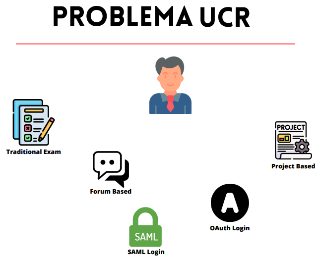
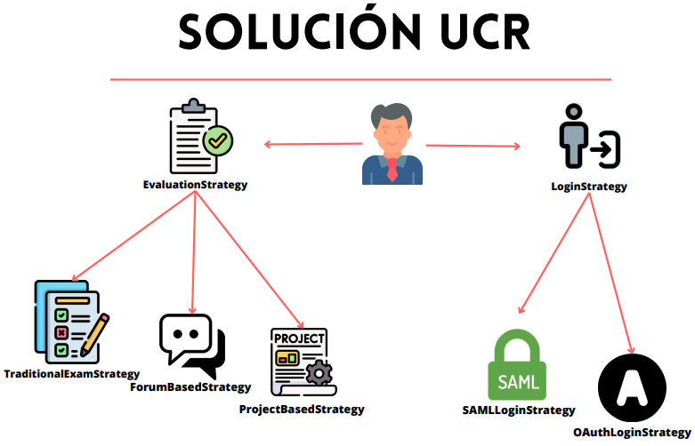
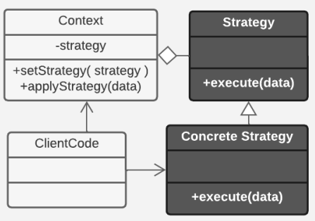

# Strategy

# Integrantes

Carlos Antonio Sanchez Blanco - C17226

Juan Carlos Aguilar Torres - C10144

# Descripción del patrón

El patrón `Strategy` es un patrón de comportamiento, el cual toma un **problema** con la peculiaridad de **ser resuelto o ejecutado de distintas formas**

Y lo que hace es crear una clase que hace de **puente** entre el **código cliente y las soluciones** al problema, las cuales son las `estrategias`

Y la idea es que el código cliente se encargue de:
1. Proveer la estrategia que desea realizar
2. Utilizar la clase que hace de **puente** para que se realice la estrategia escogida

Y el resultado es hacer que el **código cliente** y las **estrategias** interactúen por medio de una **abstracción**, y no una implementación en código

Lo que libera de cargas al código cliente y hace más entendible el uso de las estrategias para el problema

# Cuándo utilizar el patrón `Strategy`?

Es buena práctica realizar un procedimiento el cual engloba:

> **Identificación del problema**
> 
> Los **Requerimientos del código cliente**, lo que necesita que sea hecho para poder realizar su objetivo final
> 
> La **Implementación a realizar**
> 
> **Beneficios y Perjuicios** de la implementación

Esto nos permite identificar en nuestro codigo el problema que resuelve el Strategy, el cual puede ser resuelto o ejecutado por distintas funciones dependiendo de los datos del contexto

Es bastante fácil identificar un problema que se beneficie de usar el patrón strategy, los principales factores que el patrón strategy toma en cuenta de mayor a menor son:
1. Tipo de datos que serán procesados, qué atributos de estos datos hace que sea necesario tratarlos de una forma u otra
2. Beneficios y Perjuicios de distintos procedimientos que sigue el programa para un mismo problema, no sólo dependiendo de los datos que serán procesados, sino también el estado en el que el programa se encuentra por ejemplo

Habiendo definido los requerimientos del código cliente, ahora toca hacer la implementación, una solución poco eficiente, sería declarando sólo funciones las cuales serían las soluciones en el codigo cliente

El problema con esta implementación es el **alto acoplamiento** con el código cliente y **baja escalabilidad**

La solución ideal es el patrón strategy, el cual elimina exactamente esos problemas

Ya que el acoplamiento se pasa a la clase que hace de puente, y la cantidad de soluciones no afecta negativamente el programa ya que el código cliente no llama explícitamente la función, sólo conoce la solución que necesita, lo que lo hace más escalable

# Problema
Una buena forma de visualizar este patrón de forma más práctica es con un problema, uno que está relacionado con la UCR es el método de autenticación e ingreso

Donde por ejemplo, digamos que se puede acceder a los recursos de un sitio de la UCR, pero dependiendo de qué tipo de cuenta sea se necesita un método de autenticación diferente, como por ejemplo el `OAuth`, el cual se usaría para autenticar cuentas personales, como cuentas del tipo "gmail", mientras que otros tipos de correo, los del tipo "ucr.ac.cr" se necesitan tratar con otro método, como `SAMLLogin`

Además de cuentas, se puede llevar el mismo problema a métodos de evaluación en mediación virtual, los cuales pueden ser `exámenes` o `proyectos`, este al igual que el problema anterior, **tienen varias formas de hacer una misma cosa**, 



# Solución

## Solución mediocre
Una solución corriente sería que en el código que maneja el acceso y autenticación a la UCR sean manejados por puras funciones

Así de fácil se soluciona el problema, pero ahora tenemos otro problema el cual es nuestro código, ahora nuestro código es:

* Acoplado a cada función que procesa la información

* Menos cohesivo, el código tiene más responsabilidades además de las que ya tenía

* Poco escalable por el acoplamiento

* Repetición de código si cada función necesita algún preprocesado para prepararse y procesar la información

Estos serían los problemas más significativos que surgen, y podrían ser más dependiendo de qué tan poco cuidado se tenga

## Solución mejor
El mayor problema es el **acoplamiento de las funciones y el código cliente**, por lo que arreglar esto se vuelve lo más importante

Una solución a este problema del acoplamiento es haciendo **la clase puente** entre las funciones y el código, donde establecemos **una interfaz para ambos**, 

* Contexto
> La interfaz `Contexto` va a servir al código cliente

El Contexto define cómo el código cliente puede acceder a las funciones para ejecutar algo, donde en vez de ser ejecutadas por el mismo código cliente, ahora se realizan por el Contexto, y se devuelven los resultados al código cliente

* Strategy
> La interfaz `Strategy` va a servir a las funciones, que serán las distintas soluciones al mismo problema

El Strategy define **Qué es una solución**, o sea es una **Abstracción** de las funciones

Al convertir cada función en una abstracción ahora podemos acceder a todas las funciones posibles bajo un mismo concepto, en vez de conocer cada función y qué cosas tiene

La necesidad de esta abstracción, además de definir mejor **Qué es** una solución, permite a la otra interfaz, el `Contexto` referirse a las soluciones con esa abstracción para cuando tenga que trabajar con ellas, él **ya no necesita conocer a todas las soluciones, solo saber qué es una solución para identificarla y trabajar con ella**

* Concrete Strategy
> Cada una de las soluciones al problema

Estas son la implementación de una solución, las cuales cumplen con lo que dicta la interfaz `Strategy`, haciendo también mucho más fácil de entender cuando algo es una solución para el humano y la máquina

Con todas estas piezas definidas en el programa, ahora será mucho más sencillo, fácil y escalable escribir más código y más soluciones que se benefician del bajo acoplamiento de todas estas funciones

El código cliente sólo le basta tener una instancia del `Contexto` y una de las soluciones, darle la solución al `Contexto` para que la ejecute, y recibir el resultado de forma despreocupada a ejecutar la solución como tal



# Implementación del patrón
Para implementar este patrón en el programa, lo mínimo necesario es hacer las clases:

 

Fuente: [Refactoring Guru](https://refactoring.guru/design-patterns/strategy)

* Contexto

La clase que hace de **puente** entre el código cliente y las estrategias

Se encarga de quitar las cargas del código cliente, acoplandose a las estrategias él mismo en vez del código cliente

También es capaz de realizar algún proceso antes de ejecutar la estrategia

* EstrategiaAbstracta

Clase la cual sólo tiene la función de "ejecutar", la cual además toma como parámetros la información que necesita procesar, si lo necesita hacer

* EstrategiasConcretas

Clases que heredan de `EstrategiaAbstracta`, las cuales son las distintas soluciones al problema, pueden existir muchas y no afectar negativamente ningún aspecto del programa por esto

Además de esas crear esas clases, el código cliente necesita **conocer las estrategias para aplicarlas** e **interactuar con la clase `Contexto` para ejecutar las funciones**

Así se logra el patrón strategy en su forma más pura, donde el código cliente con los datos que quiere procesar llama a la clase `Contexto`, configura la clase `Strategy` en el `Contexto` y llama a ejecutar en la misma clase

También existe una abstracción más sobre **La elección de la estrategia**, el cual hace que la clase que hace de puente se encargue también de tener una lógica especial encargada a, basándose con los datos proveidos del código cliente, usar por su propia cuenta las estrategia y quitarle una carga más al código cliente de tener que conocer las estrategias para usar

# Ejemplo en código
El ejemplo en código se encuentra [aqui](src/StrategyExample.cpp)

Para compilar, basta con
```bash
make
```

Para ejecutar
```bash
bin/Strategy <tamanho> <rango>
```

Este ejemplo en codigo se basa en saber que algoritmo se adapta mejor a un arreglo para ordenar una lista de numeros random con el algoritmo mas rapido para este tipo de arreglo

Tomemos por ejemplo un arreglo de numeros de tamaño 100

El problema de ordenar los numeros de la forma mas rapida posible tiene distitnos factores, uno de ellos el cual es muy significante es el **rango el cual un numero puede tomar**(si el rango es de 1-9 en el ejemplo, entonces habrian 100 numeros entre 1-9)

Si el rango es pequeño, o sea que hay mucha repeticion de numeros, entonces un algoritmo de ordenamiento como Radix Sort o Heap Sort lograrian ordenar rapidamente el arreglo, pero si fuera muy largo, entonces esos algoritmos mas bien serian lentos, a comparacion de otros como el MergeSort

Los algoritmos que se van a probar son

1. MergeSort
2. HeapSort
3. RadixSort
4. BinSort

Con el problema definido, lo que pretende el programa es generar un arreglo aleatorio de numeros, dependiendo de los argumentos del programa que de el usuario, donde

* **El primer argumento** es el tamaño del arreglo
* **El segundo argumento** es el rango maximo que pueden tomat los numeros, con el rango minimo empezando en 0

Por ejemplo:
> bin/Strategy 100 9

Generaria valores entre 0-9 100 veces y los guarda en un arreglo para ser ordenados

Entonces se pasa ese arreglo por un analizador de arreglos, y devuelve el algoritmo, como una estrategia, que resuelve lo mas rapidamente ese arreglo

Esto lo hace pasando ese arreglo por todos los algoritmos y toma el tiempo de cada uno de ellos, los compara y devuelve el que obtuvo el menor tiempo, los tiempos se imprimen en la terminal en segundos tambien

Al ser devuelto, la clase `Sorter`, que hace como la clase Contexto, obtiene esa estrategia y la ejecuta, y acaba el programa

# Consecuencias

El patrón de diseño Strategy tiene varias consecuencias que es importante tener en cuenta al utilizarlo en el desarrollo de software.

* Ventajas:

Flexibilidad y extensibilidad: Una de las principales ventajas del patrón Strategy es su capacidad para agregar, cambiar o eliminar estrategias en tiempo de ejecución sin afectar el código cliente. Esto brinda una gran flexibilidad al sistema, ya que se pueden incorporar nuevas estrategias o modificar las existentes sin tener que modificar el código que las utiliza.

Reutilización de código: El patrón Strategy fomenta la reutilización del código, ya que las estrategias pueden ser utilizadas en diferentes contextos y aplicaciones. Esto evita la duplicación de código y promueve la mantenibilidad del sistema, ya que las estrategias pueden ser compartidas y utilizadas en diferentes partes del código.

Separación de responsabilidades: El patrón Strategy permite separar la implementación de un algoritmo de su uso y aplicación en el código cliente. Esto ayuda a mantener un diseño modular y facilita la comprensión y mantenimiento del código, ya que cada estrategia tiene una responsabilidad clara y está encapsulada en una clase separada.

* Desventajas:

Complejidad adicional: Al utilizar el patrón Strategy, se introduce una capa adicional de abstracción. Esto puede llevar a una mayor complejidad en el sistema si no se aplica de manera adecuada. Es importante diseñar las interfaces y las relaciones entre las clases de manera cuidadosa para evitar complicaciones innecesarias.

Aumento del número de clases: Como cada estrategia se implementa en una clase separada, el uso del patrón Strategy puede resultar en un aumento en el número de clases en el sistema. Si no se maneja correctamente, esto puede dificultar la comprensión y el mantenimiento del código, especialmente en sistemas grandes y complejos.

Posible degradación del rendimiento: El patrón Strategy implica un mayor nivel de indirección, ya que el código cliente debe interactuar con una interfaz y delegar la ejecución a una estrategia concreta. En comparación con una implementación directa del algoritmo, esto puede resultar en una pequeña degradación del rendimiento. Sin embargo, en la mayoría de los casos, esta degradación es insignificante y los beneficios de flexibilidad y reutilización superan cualquier impacto negativo.

# Relacion con otros patrones

El patrón Strategy se puede contrastar con otros patrones de diseño, como Template Method, Composite, State y Command, en términos de su enfoque y uso.

* Template Method: 
Tanto el patrón Strategy como Template Method se basan en la encapsulación de algoritmos. Sin embargo, difieren en su enfoque. El patrón Strategy permite cambiar dinámicamente entre diferentes estrategias, mientras que Template Method utiliza la herencia para permitir la personalización de partes específicas del algoritmo. Mientras que Strategy se centra en cambiar la estrategia completa, Template Method se enfoca en permitir cambios en etapas específicas del algoritmo.

* Composite: 
El patrón Composite se utiliza para construir estructuras jerárquicas de objetos y tratarlos de manera uniforme. A diferencia de Strategy, que se enfoca en encapsular algoritmos, Composite permite la composición de múltiples objetos en una estructura compuesta. En el contexto de Strategy, esto significa que se pueden crear estrategias compuestas, donde una estrategia puede contener y combinar múltiples estrategias más pequeñas para lograr un comportamiento complejo.

* State: 
Tanto Strategy como State se centran en encapsular comportamientos en clases separadas y permitir cambios dinámicos entre ellos. Sin embargo, se diferencian en su enfoque principal. El patrón State se centra en el cambio de estado de un objeto, donde cada estado representa un comportamiento diferente. Por otro lado, Strategy se enfoca en encapsular una única acción con múltiples implementaciones posibles. Mientras que en State el cambio de estado afecta el comportamiento general del objeto, en Strategy el cambio de estrategia afecta solo a la acción específica que se está ejecutando.

* Command: 
Tanto el patrón Strategy como Command se centran en encapsular acciones en clases y tienen una abstracción adicional entre el código cliente y la función a realizar. Sin embargo, difieren en su enfoque principal. El patrón Command se centra en definir diferentes tipos de acciones, cada una encapsulada en una clase separada, y permite al cliente ejecutar estas acciones de manera flexible. Por otro lado, Strategy se centra en encapsular una única acción con múltiples implementaciones posibles. En Strategy, el énfasis está en la variabilidad de las estrategias, mientras que en Command, el énfasis está en proporcionar una abstracción para diferentes comandos.

# Principios de disenho

> Principio de resonsabilidad unica

Este principio ciertamente se cumple gracias a la clase `Contexto`, la cual quita responsabilidades al codigo cliente y se encarga el mismo de manejar las estrategias, las cuales son las implementaciones de las soluciones

> Principio Open/Closed

Este igual se cumple, gracias al hecho de que la estructura de comunicacion, o sea las interfaces `Contexto` y `Estrategia Abstracta` no necesitan cambios al anhadir funcionalidad, y si los necesitan seran pocos, y al anhadir nuevas funciones al programa lo que se hace es crear mas clases del tipo `Estrategia Concreta`

> Segregacion de interfaces

Lo cumple tanto para el `codigo cliente` y `las soluciones`, porque define una clase para cada uno, haciendo que ahora se dependan de abstracciones por interfaces antes que puras implementaciones

> Inversion de dependencias

Lo cumple por medio de la clase `Estrategia Abstracta`, ya que hace que el codigo cliente solo necesite conocerlas soluciones, y para ejecutarlas llama a alguien que las ejecuta por el, dando toda esa carga a esa otra clase, y esta clase, la clase `Contexto` igualmente se beneficiade la inversion de dependencias por solo tener que saber **que es una solucion** y no **tener que saber todas las soluciones**

> DRY

Este patron es bueno para cuando se **necesita hacer un preprocesado antes de ejecutar cualquier solucion**, porque ese codigo solo se encontraria en la clase `Contexto`, la cual ejecuta las soluciones, y sin este patron, el codigo cliente necesitaria manejar ese preprocesado, teniendolo como otra funcion junto a las soluciones, incrementando el acoplamiento, o metiendo ese codigo en cada solucion, lo que es una repeticion de codigo terrible

Pero se soluciona muy facilmente con la clase `Contexto`

> KISS

Es mas simple solo poner funciones extras en el codigo cliente, o incluso tenerlas en una clase mas que hacer 2 clases que funcionan como interfaz, y n cantidad de clases que serian las soluciones, por lo que no cumple este principio y puede llevar a algunas malas implementaciones, donde la cura termina siendo peor que la enfermedad

Pero no llega a ningun extremo

> OOP

Cumple totalmente con el paradigma orientado a objetos, porque cada solucion es una clase, la cual hereda de otra clase, una abstraccion, y el Contexto igual es otra clase

# Referencias

refactoring. (s. f.). Strategy - https://refactoring.guru/es/design-patterns/strategy

Pankaj. (2022). Strategy Design Pattern in Java - Example Tutorial. DigitalOcean.
https://www.digitalocean.com/community/tutorials/strategy-design-pattern-in-java-example-tutorial

Mittal, N. (2021). Why we need Solid Principles and it’s types. Knoldus Blogs.
https://blog.knoldus.com/why-we-need-solid-principles-and-its-types/

Flaticon. (2023, June 10). Cube 3d Icon - 4783227. https://www.flaticon.com/free-icons/solid
