# Patrón Visitor

Presentación PDF: [Visitor Pattern](./Visitor.pdf)

## Problema
Cuando se desea agregar una nueva funcionalidad a una clase ya implementada en un sistema, existe el riesgo de que la integración de los nuevos métodos comprometa el funcionamiento previo de la clase, debido a errores o fallas en la nueva función. En lugar de modificar directamente el código de la clase, se debe buscar una alternativa que no ponga en riesgo las funcionalidades existentes ni las entorpezca con tareas adicionales que no les corresponden.

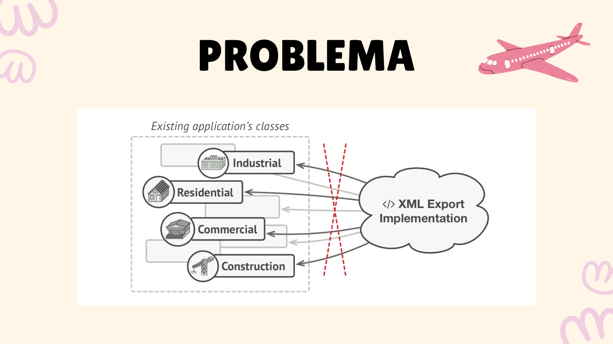
**Imagen de refactoring.guru (https://refactoring.guru/design-patterns/visitor)**

## Solución: Patrón Visitor

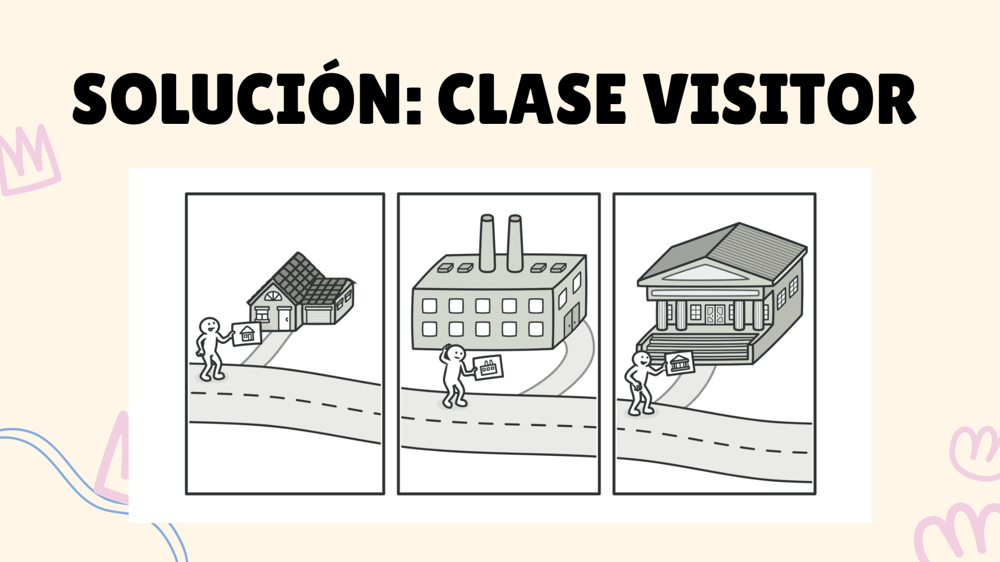
**Imagen de refactoring.guru (https://refactoring.guru/design-patterns/visitor)**

Para resolver este problema, se puede crear una clase separada llamada "Visitor" (Visitante). En esta clase se agrega el método que se desea ejecutar de manera independiente. Además, se le pasa como parámetro una referencia a la instancia de la clase con la que se va a interactuar en la funcionalidad.

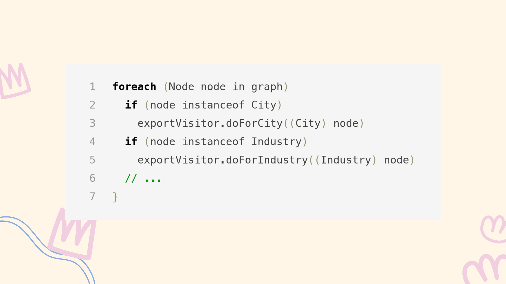
**Imagen de refactoring.guru (https://refactoring.guru/design-patterns/visitor)**

Adicionalmente, existe la solución mediante la técnica del "double dispatch" (doble despacho). Esta consiste en enviar una referencia de la clase "Visitor" a la clase en la que se desea aplicar el nuevo método, y es dentro de esta clase donde se realiza la llamada a la nueva funcionalidad.

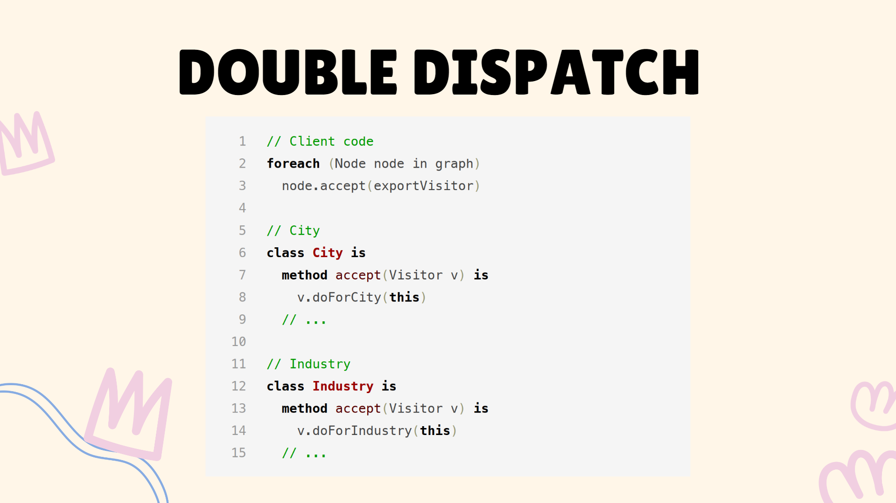
**Imagen de refactoring.guru (https://refactoring.guru/design-patterns/visitor)**

En resumen, el patrón Visitor es un patrón de comportamiento que permite separar los algoritmos de los objetos que los aplican.

## Estructura
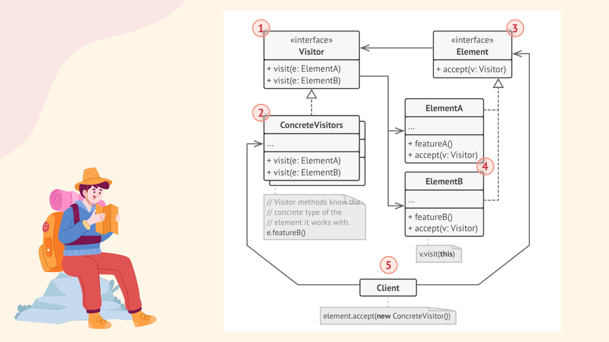
**Estructura del patrón Visitor (Diagrama de refactoring.guru: https://refactoring.guru/design-patterns/visitor)**

   El patrón Visitor sigue la siguiente estructura:

1.**Interfaz "Visitor"**: Es una clase abstracta que define los métodos que realizará la familia de "Concrete Visitors" (Visitantes Concretos).
Declara un conjunto de métodos de visita que pueden tomar como argumento elementos concretos de una estructura de objetos.
Estos métodos pueden tener los mismos nombres si el programa está escrito en un lenguaje que admite sobrecarga, pero el tipo de sus parámetros debe ser diferente.

2.**Concrete Visitors**: Son las clases concretas que implementan los métodos de la interfaz abstracta "Visitor".
Cada "Concrete Visitor" implementa varias versiones de los mismos comportamientos, adaptados para diferentes clases de elementos concretos.

3.**Interfaz "Element"**: Define la estructura de los "Concrete Elements" (Elementos Concretos).
Declara un método para "aceptar" visitantes.
Este método debe tener un parámetro declarado con el tipo de la interfaz "Visitor".

4.**Concrete Elements**: Son las clases concretas que implementan la funcionalidad de la interfaz "Element".
Implementan su propio método de aceptación, redirigiendo la llamada al método adecuado del visitante correspondiente a la clase actual del elemento.
Incluso si una clase base de elemento implementa el método de aceptación, todas las subclases deben anular este método en sus propias clases y llamar al método apropiado en el objeto visitante.

## Estructura del ejemplo
Como ejemplo utilizamos el sistemas de becas de la Universidad de Costa Rica. Los **Elementos** de la estructura Visitor son conformados por los niveles de beca; mientras que los **Visitantes** son los diferentes beneficios que se pueden aplicar dependiendo del nivel de beca: alimentación, transporte, etc...

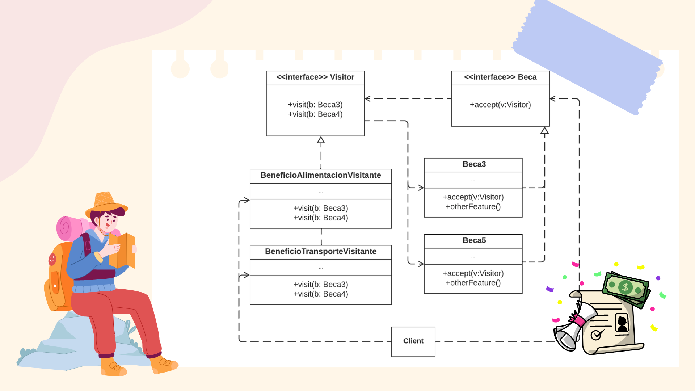
**Estructura del ejemplo de patrón Visitor**

## Implementación del ejemplo en Java

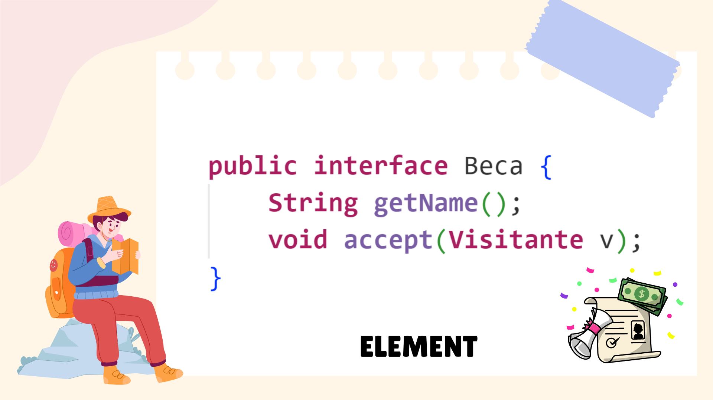
**Interfaz Elements, se define un método accept que recibe un visitante.**

**Concrete Elements, la instancia de la clase se pasa a sí misma como parámetro en el llamado del método visit.**

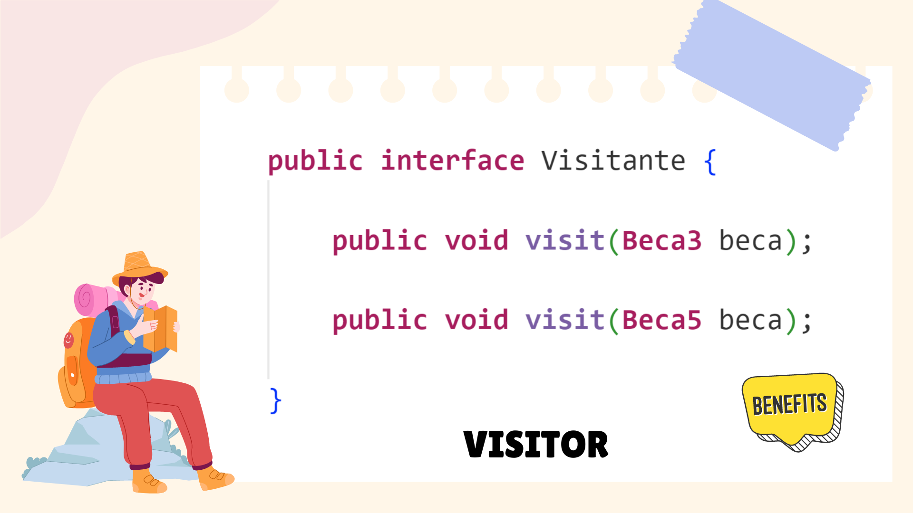
**Interfaz Visitor, se implementa el método visit por cada elemento existente.**

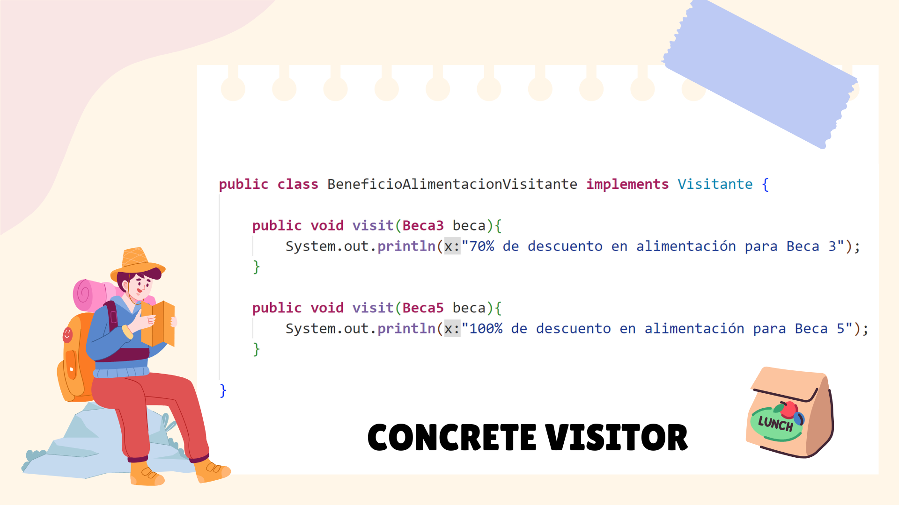
**Concrete Visitors, el comportamiento dependerá del tipo de beca (instancia) que se reciba como parámetro.**

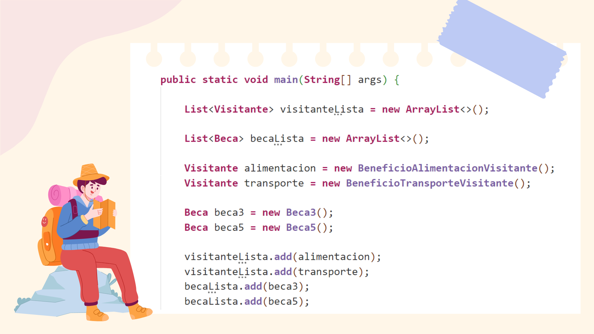
**Cliente**

**Ejemplo de iteración, se trabaja con todas las posibles combinaciones de visitantes y elementos**

**Resultado**

## Importancia del Double Dispatch
La técnica del Double Dispatch (o Doble Despacho) permite determinar el método a utilizar dependiendo de los objetos involucrados, estos pueden ser dos o más. Con el patrón visitor, el primer despacho es el llamado al método **accept** de los **elementos** y el segundo despacho corresponde el método **visit** de los **visitantes**. Si deseamos omitir la primer parte del despacho, la implementación del patrón fallará.  La implementación del método **accept** dentro de las instancias de los **elementos** le da esta certeza al compilador del tipo de instancia desde donde se está llamando el método; esto a su vez permite el llamado del método **visit** correcto, puesto que la instancia del **elementos** se pasa a sí misma como parámetro. Recordamos que el método **visit** dentro de **visitantes**, recibe instancias específicas de **elementos**, haciendo uso de overloading, el comportamiento de los métodos variará dependiendo de la firma de este. Si nos brincamos el primer despacho, el compilador no sabrá exactamente con qué tipo de instancia de los elementos se está lidiando, haciendo imposible saber cuál implementación del método **visit** utilizar.

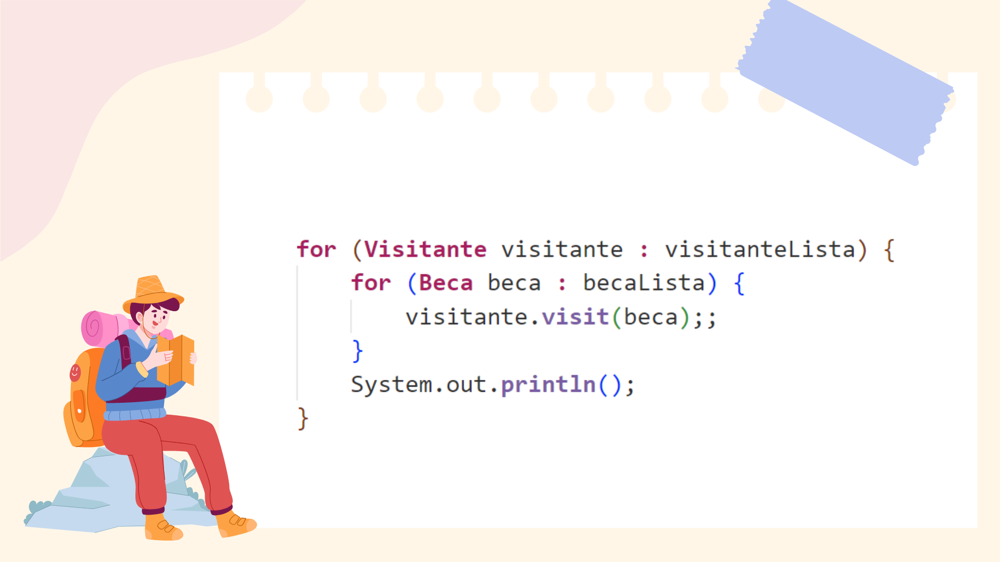
**Ejemplo de omisión del primer despacho**

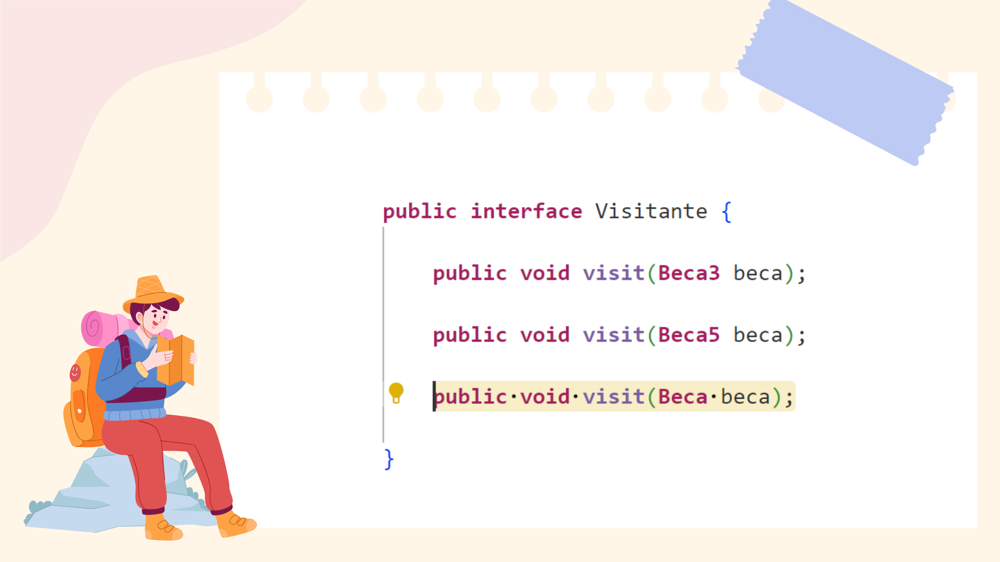
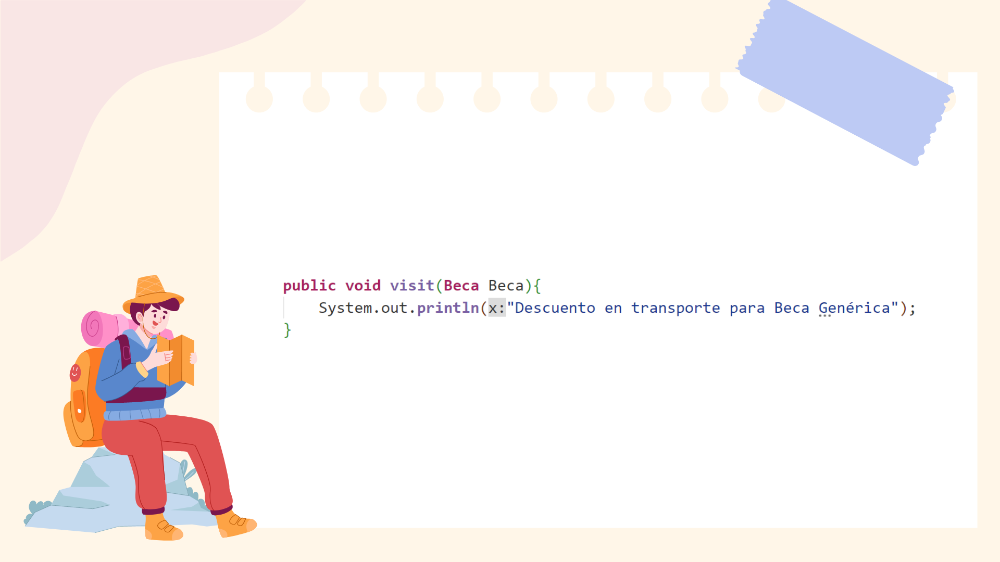
**El compilador nos pedirá implementar un método "visit" que reciba una clase base como parámetro**

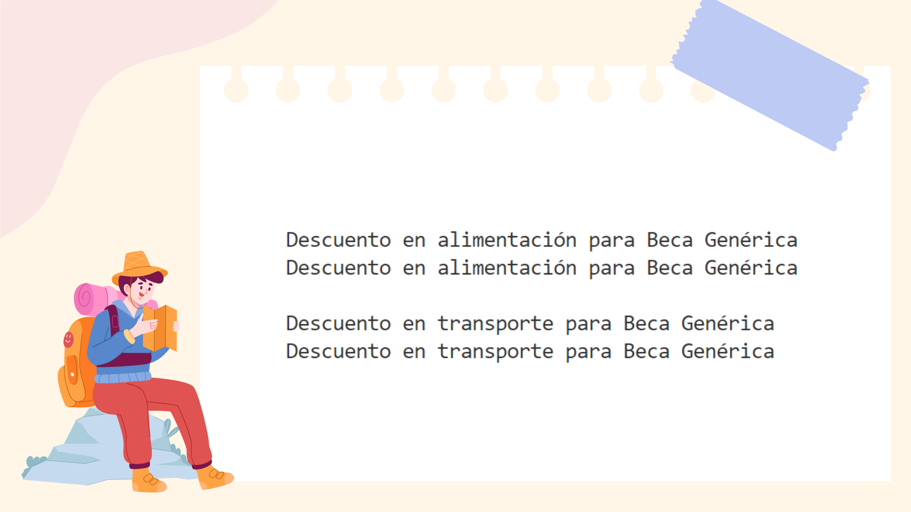
**Resultado (erróneo) de omitir el primer despacho, puesto que no se sabe con certeza la instancia del elemento, se utilizará el método visit que recibe la clase base**

## Pasos de Implementación

* Declarar la interfaz del visitante con un conjunto de métodos "visit" que reciba un elemento como parámetro, esto por cada clase de elemento concreto existente.
* Declarar la interfaz del elemento. se define un método "accept" que reciba un objeto de tipo "visitante".
* Implementar los métodos de aceptación en todas las clases de elementos concretos. Estos métodos redirigen la llamada a un método de visita en el objeto visitante entrante que coincida con la clase del elemento actual. La instancia del elemento se pasa a si misma como parámetro.
* El cliente debe crea objetos visitantes, estos son utilizados en el llamado del método "accept" de cada elemento.

## Consecuencias
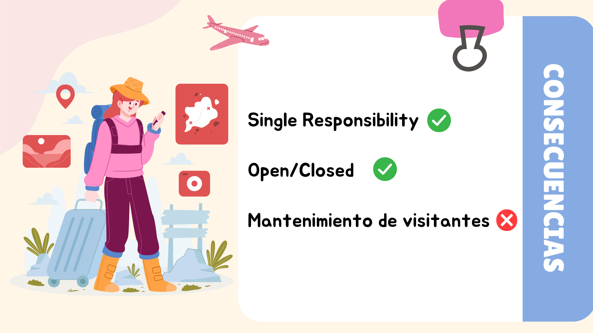

**Single Responsibility**: El patrón visitor permite separar de clases modelo comportamientos que si bien es cierto las involucra, no deberían estar implementados en ellas si se quiere seguir el principio de Single Responsibility.

**Open/Close**: Una vez que se estableció en la interfaz de los elementos un método que recibe un visitante como parámetro, se pueden implementar diferentes visitantes con diferentes comportamientos que podrán interactuar con los elementos; esto sin necesidad de hacer cambio en dichos elementos. 

**Mantenimiento de visitantes**: El uso del patrón implica realizar una actualización de todos los visitantes por cada nuevo elemento que se agregue a la solución; esto puede significar un trabajo considerable.

## Patrones relacionados
* Composite
* Command 
* Iterator

## Referencias

* Geekific. (2021, October 23). The Visitor Pattern Explained and Implemented in Java | Behavioral Design Patterns | Geekific [Video]. YouTube. https://www.youtube.com/watch?v=UQP5XqMqtqQ
* Ryan Schachte. (2019, January 20). Understanding The Visitor Design Pattern [Video]. YouTube. https://www.youtube.com/watch?v=TeZqKnC2gvA
* Refactoring.Guru. (2023b). Visitor. Refactoring.Guru. https://refactoring.guru/design-patterns/visitor

## Integrantes

* Luis Diego Barrantes B70994
* Francisco Mora Díaz C05118

