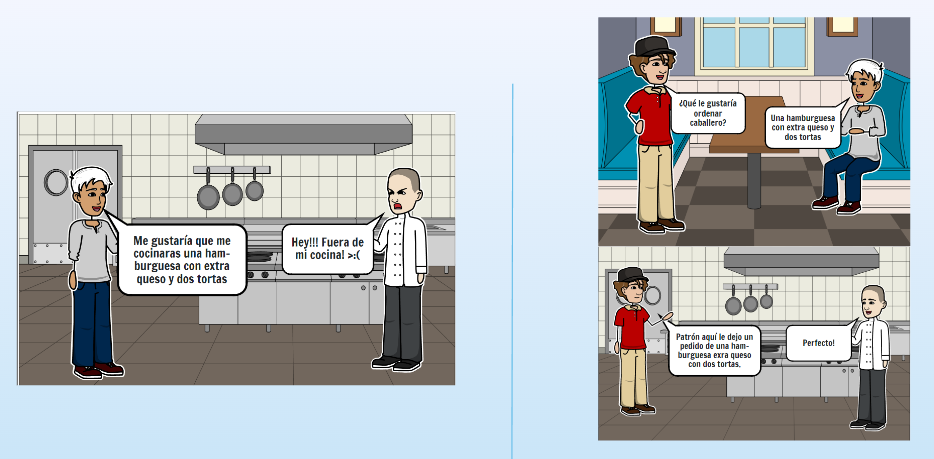
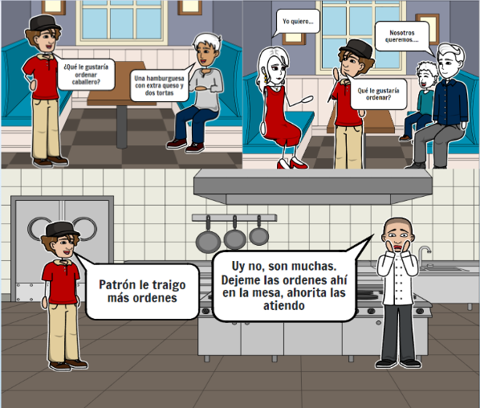
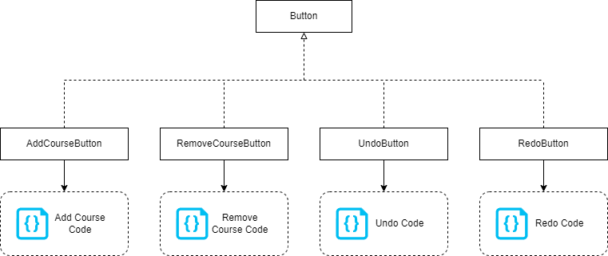
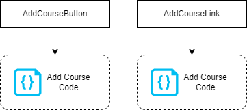
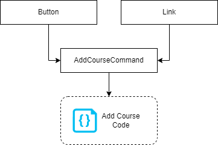
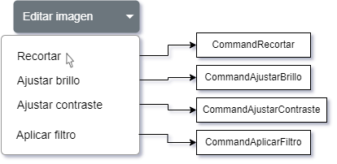
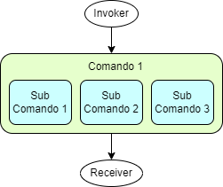
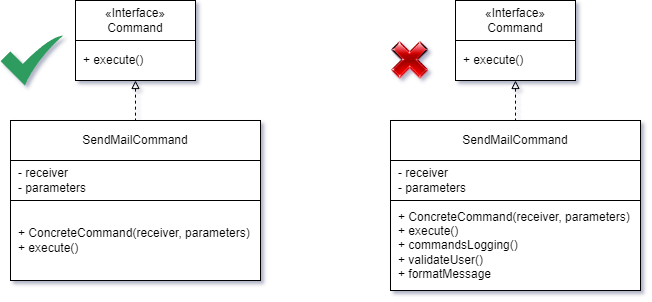
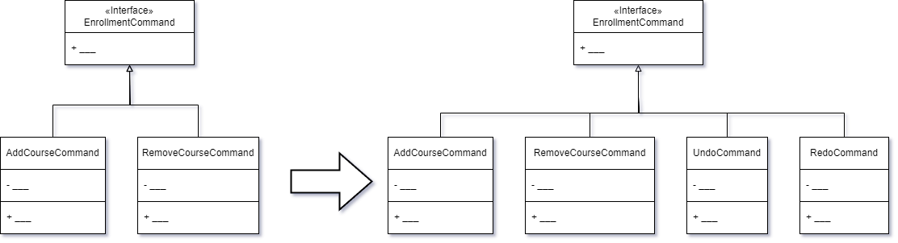

# Patrón Command

Para ver una presentación en formato `pdf` descargue el archivo [command.pdf](./command.pdf)

## 1. Integrantes

- Ángel Chaves Chinchilla C12113  
angel.chaveschinchilla@ucr.ac.cr

- Camilo Suárez Sandí C17811
camilo.suarez@ucr.ac.cr

## 2. Descripción

El patrón *Command* puede ser clasificado como un patrón de comportamiento, esta clasificación corresponde a una de las tres categorías descritas por la “Gang of Four” en su libro de Design Patterns. De acuerdo a estos autores:
> "El patrón Command encapsula una solicitud como un objeto, lo que le permite parametrizar otros objetos con diferentes solicitudes, poner en cola o registrar solicitudes y admitir operaciones que se pueden deshacer."

Para entenderlo mejor, podemos utilizar una analogia de la vida real, por ejemplo, imaginemos que estamos en un restaurante. El proceso para ordenar la comida no involucra tener un contacto directo, es decir, no nos comunicamos directamente con el chef. Si no que primero tenemos un contacto con el mesero al cual le indicamos los parámetros de nuestra orden y el mesero es el encargado de llevar nuestra orden al chef el cuál sabe ejecutarla. Veámolo en las siguientes secuencias:



De esta forma, nosotros nos desentendemos de la orden (o solicitud), la encapsulamos utilizando al mesero y el chef se encarga de ejecutarla.

Ahora supongamos que además de nosotros, hay una familia entera también solicitando la comida. El mesero lleva la solicitud mía y la de la familia al chef. Pero el chef no puede procesarlas aún, entonces están se ponen en espera, se colocan en una cola para que después sean procesadas.



Además pensemos en que la comida que nos trajeron no fue lo que pedimos, podríamos pedirle al chef (mediante el mesero) que por favor nos haga una nueva (proceso de deshacer y hacer una nueva).


## 3. Problema

En ocasiones, nos encontramos en la necesidad de realizar solicitudes a objetos sin tener conocimiento previo sobre cómo se realizan las operaciones o quién es el receptor de dichas solicitudes. Tomemos como ejemplo un sistema de matrícula universitaria que cuenta con operaciones de agregar y borrar. En este momento, deseamos añadir operaciones de deshacer y rehacer, así como también tener la capacidad de agregar futuras operaciones sin alterar las existentes. Para lograr esto, contamos con una interfaz de usuario que presenta botones correspondientes a cada una de las operaciones mencionadas. La solución más sencilla sería crear una clase base y subclases para cada una de las operaciones.



Sin embargo, esta solución presenta varios problemas. En primer lugar, se requiere crear numerosas clases, y cada vez que la clase base se modifica, es necesario realizar cambios en todas las subclases. Como resultado, el código de la interfaz depende del código relacionado con la lógica de negocio. Además, surge otro problema cuando otras clases realizan las mismas operaciones. Por ejemplo, si tenemos un botón para agregar un curso, es posible que también exista otra forma de agregar cursos a través de un enlace. Esto genera redundancia de código y complicaciones adicionales.



## 4. Solución

Un buen diseño de software se basa en el principio de separación de responsabilidades. Para abordar los problemas mencionados anteriormente, se propone implementar el patrón de diseño conocido como Command. Este patrón encapsula una solicitud como un objeto, lo que permite ejecutar diferentes solicitudes con diferentes parámetros, así como encolar o registrar solicitudes, y proporciona la capacidad de realizar operaciones de deshacer y rehacer. El punto central del patrón es convertir las solicitudes en objetos, lo que implica crear objetos para representar las solicitudes realizadas a los objetos de una aplicación. La solicitud puede ser almacenada o pasada como un argumento. El patrón establece una interfaz común para ejecutar operaciones. En lugar de que los objetos envíen las solicitudes directamente, el programador extrae las partes de la solicitud, como el objeto receptor, el nombre del método y la lista de argumentos, y las encapsula en una clase llamada Command. Esta clase incluye un método que permite ejecutar la solicitud correspondiente. Los objetos Command actúan como enlaces entre el código de la interfaz de usuario y el código de negocio. Gracias a este enfoque, el objeto de la interfaz no necesita conocer los detalles del objeto receptor ni cómo se procesa la solicitud.



Todos los comandos implementan la misma interfaz, generalmente con un método de ejecución sin parámetros. Esta característica permite utilizar los comandos con el mismo Invoker, sin acoplarlos a una clase de comandos concreta. Además, es posible cambiar los objetos Command asociados al Invoker, lo que modifica efectivamente el comportamiento del Invoker durante la ejecución del código. Al utilizar el patrón command, ya no es necesario crear múltiples subclases de botones para implementar comportamientos diferentes. En su lugar, basta con tener un atributo en la clase del botón que guarda una referencia al objeto Command correspondiente, y hacer que el botón ejecute el comando cuando sea necesario. De manera similar, otros elementos de la interfaz, como los enlaces, pueden implementar la misma operación utilizando los comandos adecuados. De esta forma, los componentes relacionados con las mismas operaciones se conectan mediante los mismos comandos, evitando la redundancia de código.


### Diagrama


### Estructura

#### Clase Invoker

La clase Invoker utiliza el objeto Command para realizar solicitudes. Es responsable de enviar las solicitudes a través de la ejecución del comando. Tiene un atributo que guarda una referencia al objeto Command correspondiente. En lugar de enviar directamente la solicitud al objeto Receiver, el Invoker ejecuta el comando. No tiene la responsabilidad de crear el objeto Command, ya que este se crea en el cliente.

#### Interfaz Command

La interfaz Command declara una interfaz para ejecutar una operación. Define un único método que permite ejecutar el comando.

#### Clases Concretas Command

Las clases concretas Command definen un enlace entre un objeto Receiver y una acción específica. Implementan el método execute y ejecutan la operación correspondiente en el objeto Receiver. Además, implementan varias solicitudes según sea necesario. Es importante destacar que un objeto concreto Command no realiza el trabajo en sí, sino que pasa la llamada al objeto de la lógica de negocio correspondiente. Aunque, para simplificar el código, es posible combinar estas clases. Los parámetros necesarios para ejecutar un método en el objeto Receiver pueden declararse como atributos en la clase concreta Command.

#### Clase Receiver

La clase Receiver conoce cómo realizar las operaciones asociadas para llevar a cabo una solicitud. Cualquier clase puede actuar como un Receiver. El Receiver contiene parte de la lógica de negocio necesaria para ejecutar la solicitud. En la mayoría de los casos, los comandos configuran cómo se envía la solicitud al objeto Receiver, mientras que el objeto Receiver realiza el trabajo real.

#### Client

El cliente es responsable de crear un objeto concreto Command y proporcionar el objeto Receiver correspondiente. El Invoker guarda el objeto concreto Command. A continuación, el Invoker realiza una solicitud para ejecutar el comando. El objeto concreto Command ejecuta las operaciones necesarias en el Receiver para llevar a cabo la solicitud. El cliente crea y configura los objetos concretos Command según sea necesario. Además, el cliente proporciona todos los parámetros necesarios para la solicitud. Una vez creado, el comando puede asociarse con uno o más objetos Invoker, según las necesidades del sistema.

## 5. Ejemplo en código

### Diagrama


### C++

#### Clase Invoker

```cpp
class Enrollment {
 private:
  std::stack<EnrollmentCommand*> undo_stack;
  std::stack<EnrollmentCommand*> redo_stack;

 public:
  void executeCommand(EnrollmentCommand* command) {
    command->execute();
    this->undo_stack.push(command);
  }

  void undo() {
    if (!this->undo_stack.empty()) {
      auto* command = this->undo_stack.top();
      command->undo();
      this->undo_stack.pop();
      this->redo_stack.push(command);
    }
  }

  void redo() {
    if (!this->redo_stack.empty()) {
      auto* command = this->redo_stack.top();
      command->execute();
      this->redo_stack.pop();
      this->undo_stack.push(command);
    }
  }
};
```

#### Interfaz Command

```cpp
class EnrollmentCommand {
 public:
  virtual void execute() = 0;
  virtual void undo() = 0;
};
```

#### Clases Concretas Command

```cpp
class AddCourseCommand : public EnrollmentCommand {
 private:
  Student& student;
  Course& course;

 public:
  AddCourseCommand(Student& student, Course& course) : student(student), course(course) {}

  void execute() override {
    this->student.getCourses().push_back(this->course);
  }

  void undo() override {
    auto& courses = this->student.getCourses();

    for (auto iterator = courses.begin(); iterator != courses.end(); ++iterator) {
      auto course = *iterator;

      if (this->course.getName() == course.getName()) {
        this->student.getCourses().erase(iterator);
        break;
      }
    }
  }
};

class RemoveCourseCommand : public EnrollmentCommand {
 private:
  Student& student;
  Course& course;

 public:
  RemoveCourseCommand(Student& student, Course& course) : student(student), course(course) {}

  void execute() override {
    auto& courses = this->student.getCourses();

    for (auto iterator = courses.begin(); iterator != courses.end(); ++iterator) {
      auto course = *iterator;

      if (this->course.getName() == course.getName()) {
        this->student.getCourses().erase(iterator);
        break;
      }
    }
  }

  void undo() override {
    this->student.getCourses().push_back(this->course);
  }
};


class UndoCommand : public EnrollmentCommand {
 private:
  Enrollment& enrollment;

 public:
  UndoCommand(Enrollment& enrollment) : enrollment(enrollment) {}

  void execute() override {
    this->enrollment.undo();
  }

  void undo() override {}
};


class RedoCommand : public EnrollmentCommand {
 private:
  Enrollment& enrollment;

 public:
  RedoCommand(Enrollment& enrollment) : enrollment(enrollment) {}

  void execute() override {
    this->enrollment.redo();
  }

  void undo() override {}
};
```
#### Clase Receiver

```cpp
class Student {
 private:
  std::string name;
  std::vector<Course> courses;

 public:
  Student(const std::string& name) : name(name) {}

  const std::string& getName() const {
    return this->name;
  }

  std::vector<Course>& getCourses() {
    return this->courses;
  }
};

class Course {
 private:
  std::string name;

 public:
  Course(const std::string& name) : name(name) {}

  const std::string& getName() const {
    return this->name;
  }
};
```

#### Client

```cpp
int main() {
  Student student("Martin Fowler");

  Course english_course("English");
  Course spanish_course("Spanish");

  Enrollment enrollment;

  enrollment.executeCommand(new AddCourseCommand(student, english_course));
  enrollment.executeCommand(new AddCourseCommand(student, spanish_course));

  enrollment.executeCommand(new UndoCommand(enrollment));

  enrollment.executeCommand(new RedoCommand(enrollment));
}
```

## 6. Implementación

### 6.1 Pasos de implementación

1. Declarar la interfaz Command con un método de ejecución único.
2. Extraer las solicitudes en clases concretas Command que implementan la interfaz Command. Cada clase debe tener un conjunto de atributos para guardar los argumentos de las solicitudes y una referencia al objeto Receiver. Todos estos valores deben inicializarse en el constructor de la clase concreta Command.
3. Identificar las clases que actúan como Invokers. Agregar atributos para guardar los comandos en estas clases. Los Invokers deben comunicarse con los comandos a través de la interfaz Command. Por lo general, los Invokers no crean los objetos Command por sí mismos, sino que los obtienen del código cliente.
4. Modificar los Invokers para que ejecuten el comando en lugar de enviar directamente una solicitud al objeto Receiver.
5. El cliente debe inicializar los objetos en el siguiente orden:
    * Crear los objetos Receivers.
    * Crear los comandos y asociarlos, si es necesario, con los objetos Receivers.
    * Crear los Invokers y asociarlos con los comandos específicos.

### 6.2 Aplicabilidad

* Cuando se desee parametrizar objetos con operaciones: El patrón Command puede convertir una llamada de método específico en un objeto independiente. Este cambio abre muchos usos interesantes: puede pasar comandos como argumentos de método, almacenarlos dentro de otros objetos, cambiar comandos vinculados en tiempo de ejecución, etc.

Por ejemplo, en una aplicación de edición de imágenes le asignaríamos a cada botón un comando específico en el momento de su creación. Pero también podríamos cambiarle este comando por uno más especializado.



* Utilice el patrón Command cuando desee poner en cola operaciones, programar su ejecución o ejecutarlas de forma remota. Por ejemplo, si en el sistema de Correo UCR quisieramos dar la oportunidad a los usuarios de programar el envío de correos cada cierto tiempo, o que la papelera se vacíe pasados unos días, ...., podríamos poner nuestroa comandos en una cola de espera y se ejecuten después de un tiempo. Para esto se requiere conocer el paradigma de programación orientado a eventos.


* Utilice el patrón Command cuando desee implementar operaciones reversibles.

## 7. Consecuencias

### 7.1 Ventajas

* Facilita la implementación de operaciones deshacer/rehacer.
* Promueve la extensibilidad y la flexibilidad del código.
* Puede implementar la ejecución diferida de operaciones (colas y registros de comandos).

### 7.2 Desventajas

* El código puede volverse más complicado ya que está introduciendo una capa completamente nueva entre remitentes y receptores.



## 8. Principios de diseño

### 8.1 SOLID

* Principio de responsabilidad única (SRP):

Cada comando tiene la responsabilidad de encapsular una operación específica y ejecutarla cuando sea necesario. Podría incumplirse si un comando también se encarga de realizar operaciones adicionales, como el registro de eventos, la notificación de otros objetos o la gestión del estado.



* Principio de Open/Closed (OCP)

Cumple con este principio al permitir la extensibilidad del código sin modificar el código existente. Se pueden agregar nuevos comandos sin alterar los objetos invocadores o los objetos receptores existentes. No se estaría cumpliendo si se debe estar modificando el objeto invocador o también la interfaz ICommand cada vez que se agreguen nuevos comandos.



* Principio de segregación de interfaces:

Cumple con este principio al definir una interfaz específica para los comandos. Cada comando implementa sólo los métodos necesarios para ejecutar la acción solicitada, evitando así la dependencia de métodos innecesarios. Podría incumplirse si se agregan métodos innecesarios a la interfaz.

* Principio de inversión de dependencia:

Cumple con este principio al permitir que los objetos invocadores no dependan directamente de los objetos receptores o de los comandos concretos. Los objetos invocadores solo conocen la interfaz común del comando.


### 8.2 DRY (Don't repeat yourself)

El patrón busca encapsular una solicitud en un objeto de comando, lo cual ayuda a evitar la duplicación de código relacionado con esa solicitud específica. El código que invoca la solicitud puede hacerlo a través de un objeto de comando sin tener que conocer los detalles específicos de la implementación.

Sin embargo, puede haber casos en los que la lógica dentro de los diferentes objetos de comando pueda duplicarse. Por ejemplo, si varios comandos realizan operaciones similares pero con variaciones menores, puede haber duplicación de código en las implementaciones de los comandos individuales.

### 8.3 (Keep it simple stup..)

En el caso del patrón Command, se puede argumentar que cumple parcialmente con el principio KISS. El patrón en sí mismo es relativamente simple, ya que se basa en la idea de encapsular una solicitud en un objeto de comando. Esto permite desacoplar el remitente de la solicitud del receptor, lo cual puede simplificar la lógica del código.

Sin embargo, a medida que se aplica el patrón Command en situaciones más complejas, puede introducir cierta complejidad adicional. Por ejemplo, puede requerir la creación de múltiples clases de comandos para representar diferentes operaciones, y la gestión de la cola de comandos puede agregar una capa adicional de complejidad.

### 8.4 OOP

Encapsulamiento: El patrón permite encapsular una solicitud en un objeto individual.
Abstracción: El patrón Command utiliza interfaces o clases base abstractas para representar los comandos,  lo que permite crear diferentes implementaciones de comandos para diferentes tipos de solicitudes.
Polimorfismo: Permite que los comandos concretos sobreescriban los métodos definidos en la interfaz.


## 9. Relación con otros patrones

* Cadena de responsabilidad: Pasa una solicitud secuencialmente a lo largo de una cadena dinámica de receptores potenciales hasta que uno de ellos la maneja.
* Observer: Permite a los receptores *Receivers* suscribirse y darse de baja dinámicamente de las solicitudes de recepción.
* Memento: Se puede usar con Command para implementar undo. Los Commands realizan varias operaciones sobre un objeto destino y los Memento guardan el estado de ese objeto.
* Prototype: Puede ayudar cuando necesite guardar copias de Comandos en el historial

# Referencias

Refactoring Guru. (s.f.). Command. Recuperado de https://refactoring.guru/design-patterns/command

Gamma, E., Helm, R., Johnson, R., & Vlissides, J. (1995). Design Patterns: Elements of Reusable Object-Oriented Software. Addison-Wesley.

DigitalOcean. (s.f.). Command Design Pattern. Recuperado de https://www.digitalocean.com/community/tutorials/command-design-pattern

Spring Framework Guru. (s.f.). Command Pattern. Recuperado de https://springframework.guru/gang-of-four-design-patterns/command-pattern/

Banas, D. (2012, 10 de octubre). Design Patterns: Command Pattern [Video]. YouTube. Recuperado de https://www.youtube.com/watch?v=9qA5kw8dcSU

