# ITERATOR

## Introducción

El patrón Iterator es relativo al comportamientode los objetos. Para explicarlo, podemos pensar en una mochila, que cuenta con varios compartimentos donde tenemos lapiceros, cuadernos, cargadores, etc. 
Cuando queremos buscar algún implemnto dentro de la mochila, lo hacemos aleatoriamente, sin nigún orden en particular.

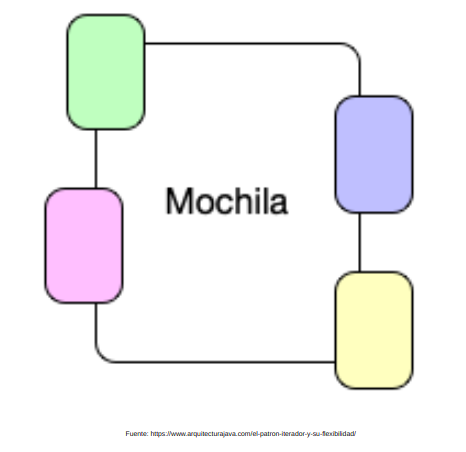

Entonces, si vemos desde un punto de vista de software este problema, los compartimentos serian un objeto que contiene implementos.
Y para recorrer esta lista de objetos no tenemos ningún orden en particular.

## Problema

El patrón Iterator se usa en el contexto de las listas y conjuntos. Tenemos una serie de objetos que internamente trabajan con conjuntos de elementos y necesitamos manipularlos abstrayéndonos de cómo están implementados internamente.
De esta manera si por alguna razón de eficiencia o funcionalidad necesitáramos cambiar la implementación interna del conjunto de elementos, el resto de nuestro sistema seguiría funcionando sin problemas.

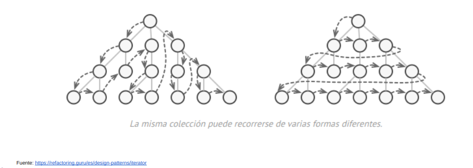

## Solución

La solución consiste en crear una interfaz Iterator que estandarice los métodos para tratar la colección de elementos. Esta interfaz definirá una serie de operaciones para manipular los elementos del conjunto, como puede ser next() para obtener el siguiente elemento, hasNext() para comprobar que sigue habiendo elementos en el conjunto, current() para obtener el elemento actual o first() para mover el cursor al primer elemento y a la obtener una referencia al mismo.

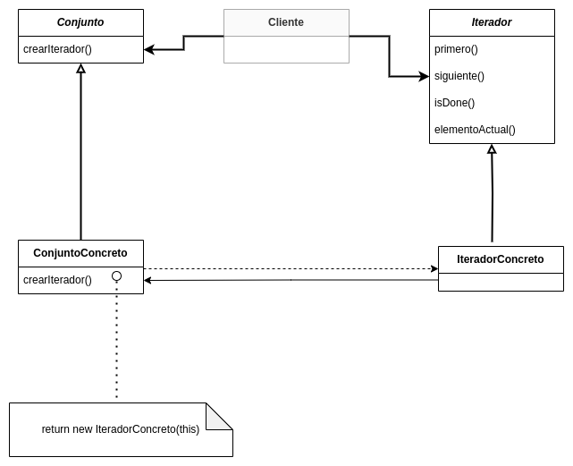

Esta interfaz definirá una serie de operaciones para manipular los elementos del conjunto, 

- siguiente() para obtener el siguiente elemento
 
- haySiguiente() para comprobar que sigue habiendo elementos en el conjunto, 

- actual() para obtener el elemento actual 

- primero() para mover el cursor al primer elemento y a la obtener una referencia al mismo.

Participantes:
- Iterador: define interfaz para acceder y recorrer elementos

- Iterador Concreto:
	Implementa la interfaz Iterator
	Mantiene la posición actual en el recorrido del agregado

- Conjunto: define la interfaz para crear un objeto Iterator

- Conjunto Concreto: implementa una interfaz de creación del Iterator para devolver la instancia de ConcreteIterator apropiada

### Solución: Ejemplo con Mediación Virtual

Queremos desplegar las asignaciones de un curso particular para que el usuario los vea.

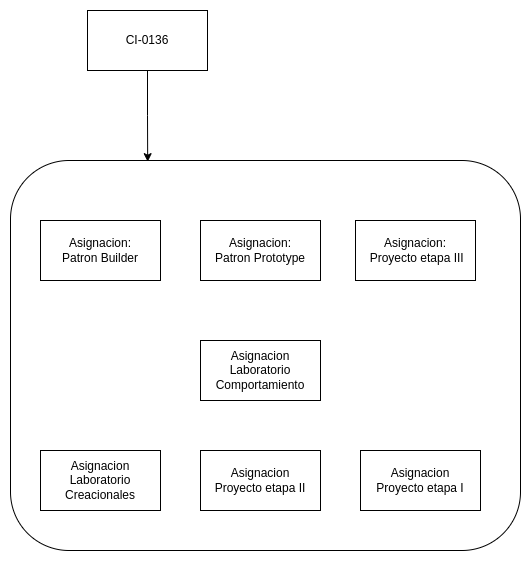

Hay dos distintos tipos de contenedores para los cursos según su orden cronológico, y su categoría.

Lista simple

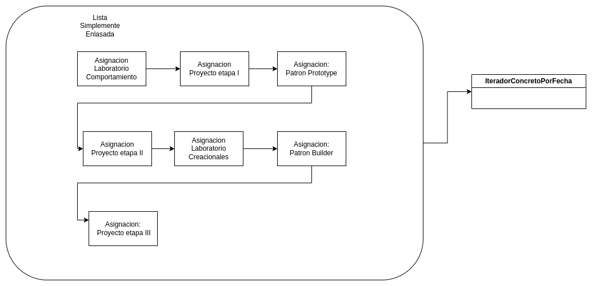

Arbol

## Ejemplo de código

Aquí tenemos una interfaz común Aggregate para el cliente ya que lo desacopla de la implementación de su colección de objetos.
El ConcreteAggregate implementa createIterator() que devuelve iterador para su colección.
La responsabilidad de cada ConcreteAggregate es instanciar un ConcreteIterator que pueda iterar sobre su colección de objetos.
La interfaz del iterador proporciona un conjunto de métodos para recorrer o modificar la colección que además de next()/hasNext() también puede proporcionar funciones para buscar, eliminar, etc.

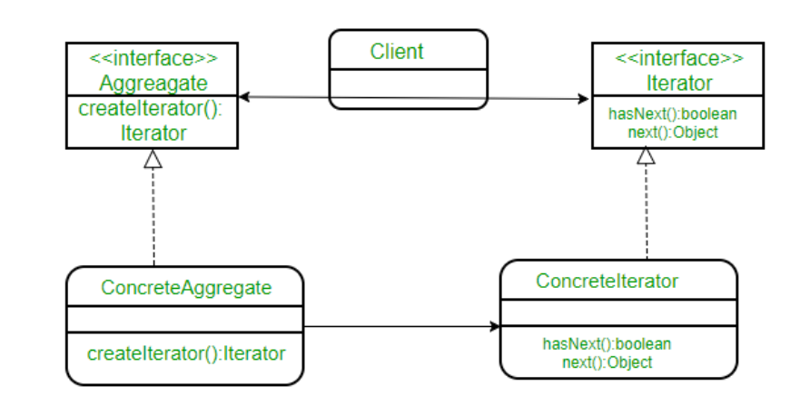Fuente: [gfg](https://www.geeksforgeeks.org/iterator-pattern/)

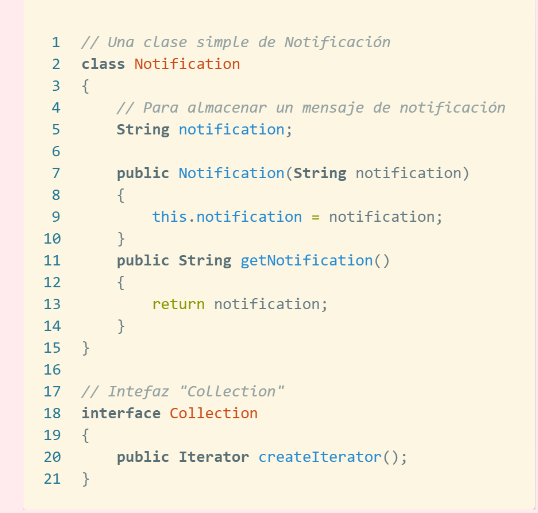

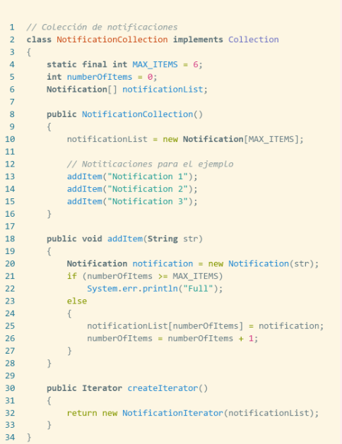

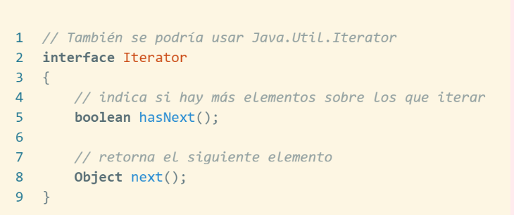

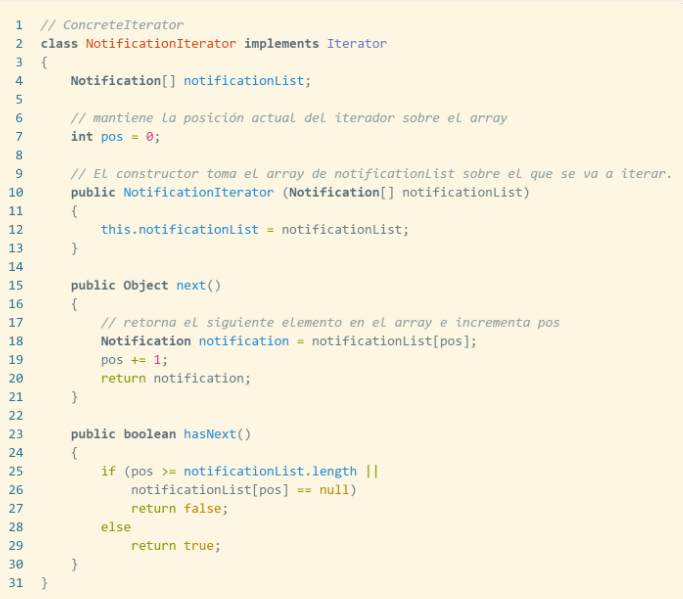

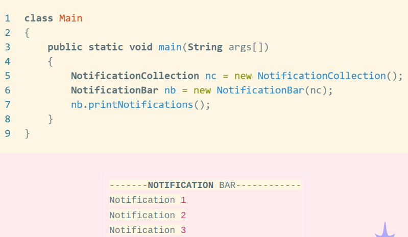

## Consecuencias: 
### Ventajas: 
- Principio de responsabilidad única. Puede limpiar el código del cliente y las colecciones extrayendo los algoritmos transversales voluminosos en clases separadas.

- Principio Abierto/Cerrado. Puede implementar nuevos tipos de colecciones e iteradores y pasarlos al código existente sin romper nada.

- Puedes iterar sobre la misma colección en paralelo porque cada objeto iterador contiene su propio estado de iteración.

- Por la misma razón, puedes retrasar una iteración y continuarla cuando sea necesario.

### Desventajas:

- Aplicar el patrón puede resultar excesivo si la aplicación sólo trabaja con colecciones sencillas.
- Utilizar un iterador puede ser menos eficiente que recorrer directamente los elementos de algunas colecciones especializadas.

## Implementación:

Utilice el patrón Iterator cuando su colección tenga una estructura de datos compleja pero desee ocultar su complejidad a los clientes (ya sea por conveniencia o por razones de seguridad).

El iterador encapsula los detalles de trabajar con una estructura de datos compleja, proporcionando al cliente varios métodos simples para acceder a los elementos de la colección. Si bien este enfoque es muy conveniente para el cliente, también protege la colección de acciones descuidadas o maliciosas que el cliente podría realizar si trabaja directamente con la colección.

Use el patrón para reducir la duplicación del código transversal en su aplicación.

El código de los algoritmos de iteración no triviales tiende a ser muy grande. Mover el código transversal a los iteradores designados puede ayudar a hacer que el código de la aplicación sea más ágil y limpio.

Utilice el iterador cuando desee que su código pueda atravesar diferentes estructuras de datos o cuando los tipos de estas estructuras se desconozcan de antemano.

El patrón proporciona un par de interfaces genéricas tanto para colecciones como para iteradores. Dado que su código ahora usa estas interfaces, seguirá funcionando si le pasan varios tipos de colecciones e iteradores que implementan estas interfaces.

## Relación con otros patrones:

Puede usar iteradores para atravesar árboles compuestos.

Puede usar Factory Method junto con Iterator para permitir que las subclases devuelvan diferentes tipos de iteradores que sean compatibles con las colecciones.

Puede usar Memento junto con Iterator para capturar el estado de iteración actual y revertirlo si es necesario.

Puede usar Visitor junto con Iterator para atravesar una estructura de datos compleja y ejecutar alguna operación sobre sus elementos, incluso si todos tienen diferentes clases.

## Conclusión

Trabajamos en un mundo de software en el que se intercomunican diferentes sistemas, exponiendo diferentes interfaces y diferentes formas de almacenar los datos. Esto, nos llena de diferentes conjuntos con los mismos datos. 
El patrón Iterador nos permite recorrer diferentes conjuntos de datos usando el mismo código común y sin tener que cambiar nuestra implementación cada que una nueva estructura de datos entra en juego.
Esto nos presenta una gran ventaja y ahorro de tiempo. Cómo futuros ingenieros de software es importante entender estos patrones para poder mejorar y/o implementar código eficiente y de calidad.

## Referencias

Caules, C. Á. (2022). El patrón Iterador y su flexibilidad. Arquitectura Java. https://www.arquitecturajava.com/el-patron-iterador-y-su-flexibilidad/ Design Patterns - Iterator Pattern. (n.d.). https://www.tutorialspoint.com/design_pattern/iterator_pattern.htm GeeksforGeeks. (2022). Iterator Pattern. GeeksforGeeks. https://www.geeksforgeeks.org/iterator-pattern/ Iterator. (n.d.-a). https://refactoring.guru/es/design-patterns/iterator Iterator. (n.d.-b). https://reactiveprogramming.io/blog/es/patrones-de-diseno/iterator SL, P. E. C. (n.d.). Patrones de Dise�o (XVII): Patrones de Comportamiento - Iterator. Programación En Castellano. https://programacion.net/articulo/patrones_de_diseno_xvii_patrones_de_comportamiento_iterator_1020