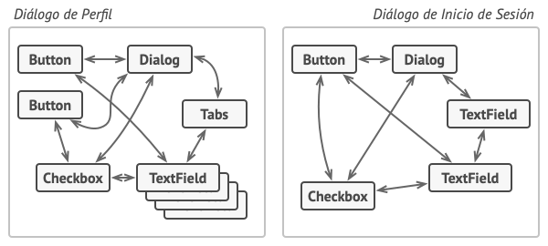
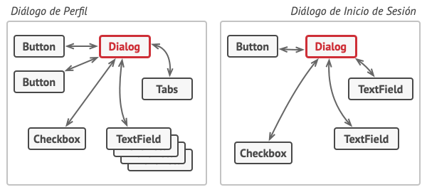
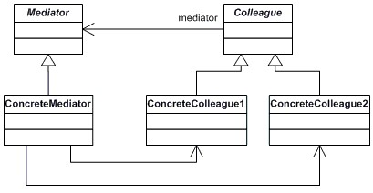
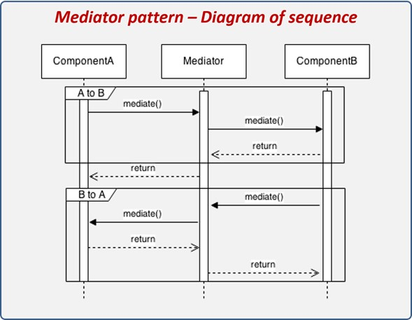
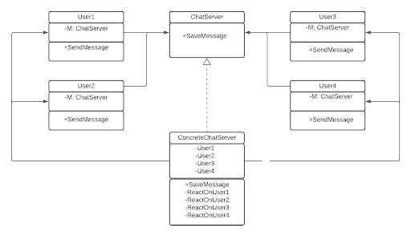

# Mediator Pattern

## Descripción básica

Patron de diseño el cual permite que no existan tantas dependencias entre objetos, eliminando la comunicacion directa entre ellos y comunicando los objetos atraves de un objeto mediador.

## Problema 

A la hora de crear un programa puede darse el escenario que estamos repitiendo multiples veces el mismo codigo dado que no se puede reutilizar ya que se encuentra fuertemente acoplado con otros objetos. Lo ideal seria encontrar alguna forma de poder reutilizar componentes para todos los diferentes casos y no crear el mismo componente para cada caso haciendo el codigo repetitivo.

Ejemplo del problema:



Imagen 1 (Zhart, Dmitry, 2019)

Aca se puede ver como los diferentes componentes se encuentran fuertemen acoplados unos con los otros lo que  no nos permite reutilizarlos para otros casos.

## Solución

Para poder reutilizar los componentes y reducir la dependecia entre objetos lo que se debe hacer es cortar toda comunicacion directa entre objetos. Ahora los objetos unicamente se comunicaran atraves de un objeto mediador, pasando a depender de multiples objetos a solo depende del objeto mediador.El objeto mediador .Esto no es lo unico que solucionamos ya que entres menos dependecias tenga una clase mas facil es su edición.

Ejemplo de la solucion:



Imagen 2 (Zhart, Dmitry, 2019)

Aca podemos ver como se detiene toda comunicacion directa entre objetos y todas los componentes pasan a depende unicamente de objeto mediador "dialog".

Ejemplo con mediacion virtual:


Imagen 3 (Rojas, Esteban, 2023)

Aca podemos ver como los diferentes usuarios dentro de un chat server se comunican unicamente por el servidor.

### Estructura del patrón



Imagen 4 (Segio, 2019)

### Diagrama de secuencia



Imagen 5 (Esteban Rojas, 2023)

## Ejemplo en código

A continuación, un ejemplo en código del patrón decorator con comentarios que explican los diferentes métodos y clases. 

```c++
from __future__ import annotations

class Mediator():

    def notify(self, sender: object, event: str) -> None:
        pass

class ConcreteMediator(Mediator):
    def __init__(self, component1: Component1, component2: Component2) -> None:
        self._component1 = component1
        self._component1.mediator = self
        self._component2 = component2
        self._component2.mediator = self

    def notify(self, sender: object, event: str) -> None:
        if event == "A":
            print("Mediator reacts on A and triggers following operations:")
            self._component2.do_c()
        elif event == "D":
            print("Mediator reacts on D and triggers following operations:")
            self._component1.do_b()
            self._component2.do_c()

class BaseComponent:

    def __init__(self, mediator: Mediator = None) -> None:
        self._mediator = mediator

    @property
    def mediator(self) -> Mediator:
        return self._mediator

    @mediator.setter
    def mediator(self, mediator: Mediator) -> None:
        self._mediator = mediator

class Component1(BaseComponent):
    def do_a(self) -> None:
        print("Component 1 does A.")
        self.mediator.notify(self, "A")

    def do_b(self) -> None:
        print("Component 1 does B.")
        self.mediator.notify(self, "B")


class Component2(BaseComponent):
    def do_c(self) -> None:
        print("Component 2 does C.")
        self.mediator.notify(self, "C")

    def do_d(self) -> None:
        print("Component 2 does D.")
        self.mediator.notify(self, "D")

if __name__ == "__main__":
    # The client code.
    c1 = Component1()
    c2 = Component2()
    mediator = ConcreteMediator(c1, c2)
    print()

    print("Client triggers operation A.")
    c1.do_a()

    print("\n", end="")

    print("Client triggers operation D.")
    c2.do_d()
    print()
```

## Consejos de implementación

1. El mediador se puede encargar de crear y destruir los componenetes del sistema, por lo que en el codigo cliente solo se invoca a la creacion de un componenete por parte de este y cuando se deja de utilizar este mismo los elimina.

2. Los componentes deben referenciar al objeto mediador correcto, ya que si existen varios mediadores en el mismo sistema, se pueden generar distintos problemas en la comunicacion.

3. Enfocarse en que cualquier tipo de comunicacion que tengan los componentes sea por medio del mediador, ya que sino se rompe el principio SOLID de Single Responsability.


## Consecuencias
### Positivas:

+ Todas las comunicaciones se centralizan em um solo objeto mediador lo cual funcionapara tener un mejor control em el flujo de informacion en el sistema.
+ Se puede cambiar la interacción sin la necesidad de cambiar el codigo de los componentes. 
+ Mayor desacoplamiento entre componentes por lo que este permite mayor facilidad a la hora de querer modificar los componenetes ya existentes o querer agregar nuevos componentes.

### Negativas:

+ La clase mediator podría convertirse en un God Object en el caso de que a este se le asignen muchas funcionalidades, y este sea una parte mayoritaria del sistema .

**Nota** God object es un componente en un sistema que posee muchas funcionalidades y que conoce demasiado de otras clases.

## Relación con otros patrones

Relación con otros patrones

+ Facade: Ambos patrones toman funcionalidades de componentes, pero el patrón Facade se encarga en la interacción entre el usuario y los sistemas, mientras que el Mediator se encarga de la interacción entre componentes.
+ Observer: El patrón Mediator puede funcionar como Observer, si este toma funcionalidades de notificador, ya que es la funcion principal del Observer.


## Ejemplo mediación virtual

En el siguiente diagrama de clases se logra observar como se utiliza el patron Mediator para la comunicacion de los usuarios por medio del chat de Mediacion Virtual, logrando tener un control en el flujo de mensajes, y logrando poder tener un registro de los mismos.



Imagen 6 (Rojas, Esteban, 2023)

## Referencias

Mediator. (s. f.). https://reactiveprogramming.io/blog/es/patrones-de-diseno/mediator

Sergio. (2019). Mediator design pattern: En dos aplicaciones. DEV Community. https://dev.to/imsergiobernal/mediator-design-pattern-en-dos-aplicaciones-3j9k

Shvets, Alexander. (2021) Mediador. https://refactoring.guru/es/design-patterns/mediator
