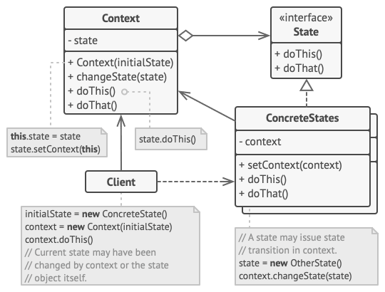
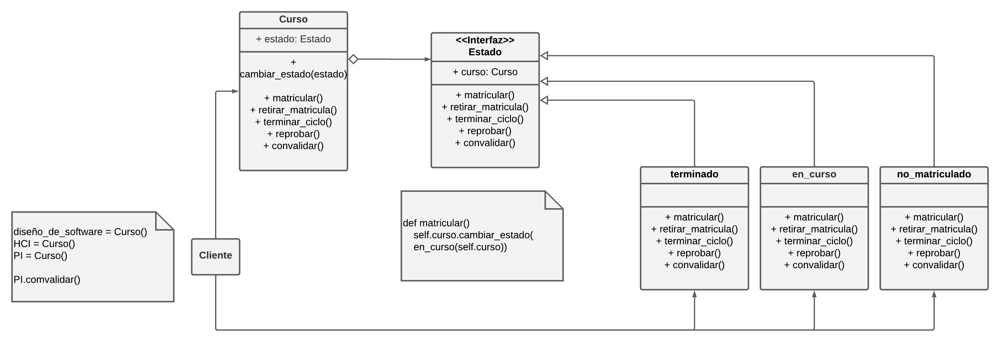

# Patrón State

## Nombres
El patrón de software conocido como **State** también se conoce como **Objeto de Estado** o **Máquina de Estados**.

## Problema
El patrón State es útil en escenarios donde un objeto debe cambiar su comportamiento según su estado interno. Este patrón es especialmente útil cuando existen múltiples estados complejos en los que puede estar un objeto y cuando las transiciones entre estados deben ser gestionadas de manera flexible y extensible.

Un ejemplo de uso del patrón State es en mediación virtual, donde los cursos pueden tener diferentes estados (no matriculado, en curso, terminado) y transiciones (matricular, reprobar, aprobar, retirar matricula, convalidar) como se puede observar en el siguiente diagrama de estados:


## Solución
La solución propuesta por el patrón State consiste en tener una interfaz o clase abstracta llamada "Estado" que define los métodos que representan las operaciones asociadas a cada estado posible. Cada estado concreto implementa esta interfaz o hereda de la clase abstracta y define su propio comportamiento en respuesta a las operaciones llamadas por el contexto.

El contexto es la clase que contiene el estado actual y mantiene una referencia a un objeto de estado concreto. El contexto delega las operaciones relacionadas con el estado al objeto de estado actual. Esto permite que el comportamiento del objeto varíe según su estado interno.

A continuación una plantilla del patrón State con sus componentes definidos:



[Plantilla en código](src/plantilla_state.py)

### Interfaz estado
```python
from abc import ABC, abstractmethod

# Clase abstracta para definir la interfaz de los estados
class Estado(ABC):

    # init method or constructor
    def __init__(self, contexto):
        self._contexto = contexto

    @abstractmethod
    def accion_x(self):
        pass

    @abstractmethod
    def accion_y(self):
        pass
```

### Estados concretos
```python
# Estado concreto
class estado_concreto1(Estado):
    def accion_x(self):
        print("Estado concreto 1")
        self._contexto.cambiar_estado(estado_concreto2(self._contexto))

    def accion_y(self):
        print("Transición incorrecta")

# Estado concreto
class estado_concreto2(Estado):
    def accion_y(self):
        print("Estado concreto 2")
        self._contexto.cambiar_estado(estado_concreto1(self._contexto))

    def accion_x(self):
        print("Transición incorrecta")
```
### Contexto
```python
# Contexto
class Contexto:
    def __init__(self):
        # Estado inicial
        self.estado_actual = estado_concreto1(self)

    def cambiar_estado(self,estado):
        self.estado_actual = estado

    def accion_x(self):
        self.estado_actual.accion_x()

    def accion_y(self):
       self.estado_actual.accion_y()
```
### Implementación/contexto
```python
if __name__ == "__main__":
            
    contexto = Contexto()
    contexto.accion_x()
    contexto.accion_y()


    contexto.cambiar_estado(estado_concreto2(contexto))
```

## Ejemplo en código

### Solución UML de los estados de los cursos en MV

### [Solución en python](src/mediacion_virtual_ejemplo.py)

```python
from abc import ABC, abstractmethod

# Clase abstracta para definir la interfaz de los estados
class Estado(ABC):

    @property
    def curso(self):
        return self._curso
    @curso.setter
    def curso(self, curso) -> None:
        self._curso = curso

    # init method or constructor
    def __init__(self, curso):
        self._curso = curso

    @abstractmethod
    def matricular(self):
        print("No se puede matricular")

    @abstractmethod
    def retirar_matricula(self):
        print("No se puede retirar el curso")

    @abstractmethod
    def terminar_ciclo(self):
        print("No se puede terminar el curso")

    @abstractmethod
    def convalidar(self):
        print("No se puede convalidar el curso")

    @abstractmethod
    def reprobar(self):
        print("No se puede reprobar este curso")
    
# Estado no matriculado
class no_matriculado(Estado):
    def matricular(self):
        self.curso.cambiar_estado(en_curso(self.curso))
        print(f"Curso matriculado exitosamente. \nEstado: {self.curso.estado_actual.__class__}")
        
    def retirar_matricula(self):
        super().retirar_matricula()

    def convalidar(self):
        self.curso.cambiar_estado(terminado(self.curso))
        print(f"Curso convalidado exitosamente. \nEstado: {self.curso.estado_actual.__class__}")
        
    def reprobar(self):
        super().reprobar()

    def terminar_ciclo(self):
        super().terminar_ciclo()

# Estado en curso
class en_curso(Estado):
    def matricular(self):
        super().matricular()

    def retirar_matricula(self):
        self.curso.cambiar_estado(no_matriculado(self.curso))
        print(f"Curso retirado exitosamente. \nEstado: {self.curso.estado_actual.__class__}")

    def convalidar(self):
        super().convalidar()

    def reprobar(self):
        super().reprobar()
    
    def terminar_ciclo(self):
        self.curso.cambiar_estado(terminado(self.curso))
        print(f"Curso terminado. \nEstado: {self.curso.estado_actual.__class__}")

# Estado terminado
class terminado(Estado):
    def matricular(self):
        super().matricular()

    def retirar_matricula(self):
        super().retirar_matricula()

    def convalidar(self):
        super().convalidar()

    def reprobar(self):
        self.curso.cambiar_estado(no_matriculado(self.curso))
        print(f"Curso reprobado. \nEstado: {self.curso.estado_actual.__class__}")

    def terminar_ciclo(self):
        super().terminar_ciclo()

# Contexto
class Curso:
    def __init__(self):
        # Estado inicial
        self.estado_actual = no_matriculado(self)

    def cambiar_estado(self,estado):
        self.estado_actual = estado

    def matricular(self):
        self.estado_actual.matricular()

    def retirar_matricula(self):
        self.estado_actual.retirar_matricula()

    def convalidar(self):
        self.estado_actual.convalidar()

    def reprobar(self):
        self.estado_actual.reprobar()

    def terminar_ciclo(self):
        self.estado_actual.terminar_ciclo()

diseño_de_software = Curso()
HCI = Curso()
PI = Curso()

def inicio_de_lecciones():        
    print("Matriculo Diseño de Software:")
    diseño_de_software.matricular()
    print("Matriculo HCI:")
    HCI.convalidar()
    print("Matriculo PI:")
    PI.matricular()

def fin_de_lecciones():        
    print("\nFin de ciclo lectivo")
    print("Termino Diseño de Software:")
    diseño_de_software.terminar_ciclo()
    print("Termino HCI:")
    HCI.terminar_ciclo()
    print("Termino PI:")
    PI.terminar_ciclo()

if __name__ == "__main__":
            
    inicio_de_lecciones()
    fin_de_lecciones()

    print("\nReprobé Diseño de Software:")
    diseño_de_software.reprobar()
```

## Consecuencias

El patrón State ayuda a lograr una mayor cohesión y flexibilidad en un sistema. Permite que un objeto altere su comportamiento dinámicamente según su estado interno, sin la necesidad de utilizar condicionales extensos. Esto facilita la adición de nuevos estados sin modificar el código existente y mejora la legibilidad y mantenibilidad del código.

Sin embargo, aplicar el patrón State puede aumentar la complejidad al agregar una mayor cantidad de clases al sistema. Además, si existen transiciones complejas entre los estados, puede requerir lógica adicional para controlar la secuencia de cambio de estado.

### Positivas
- Single Resposibility Principle
- Open/Closed Principle (escalabilidad)
- Chao condiciones

### Negativas
- Overkill

## Implementación

Al implementar el patrón State, es importante considerar las siguientes sugerencias:

1. Definir una interfaz o clase abstracta para representar el estado y definir los métodos comunes que se utilizarán en todos los estados.
1. Implementar una clase concreta para cada estado posible, que implemente los métodos de la interfaz o herede de la clase abstracta Estado.
1. En el contexto, mantener una referencia al estado actual y delegar las operaciones relacionadas con el estado al objeto de estado correspondiente.
1. Permitir cambios de estado en el contexto mediante métodos específicos, o bien, definir un mecanismo para cambiar de estado automáticamente.

## Relación con otros patrones

- Strategy/Bridge: Estos patrones permiten cambiar el comportamiento de un objeto, pero mientras que el patrón State se enfoca en cambiar el comportamiento según el estado interno, el patrón Strategy y Bridge se centran en cambiar el comportamiento utilizando diferentes estrategias.
- Singleton: State puede combinarse con Singleton para garantizar que solo exista una instancia de
