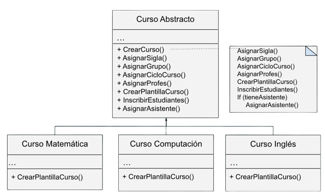

# Solución

### **Solución para problema de las bebidas calientes**
Para generar una solución más óptima al [problema de las bebidas calientes](./Problema.md/#problema-de-bebidas-calientes) podemos utilizar el patrón Template Method, ya que permitirá definir una estructura para cada bebida caliente, definiendo de antemano varios métodos que se utilizan para todas las bebidas calientes, así evitando la redundancia código y que de esta manera cada nueva bebida caliente que se quiere implementar sea más fácil de agregar y solo deberá definir pocos métodos únicos.

Para observar un ejemplo de implementación diríjase al siguiente [código](./../src/Bebida.py)

### **Solución para problema de la UCR**
Para generar una solución más óptima al [problema de la UCR](./Problema.md/#problema-dentro-de-un-contexto-de-la-ucr) podemos utilizar el patrón de comportamiento Template Method, ya que se logrará definir una estructura por medio de pasos para todos los cursos que sean creados en un futuro y evitar redundancia de código al declarar e implementar los métodos que son utilizados por todos los cursos en una clase en común.

Por lo que, siguiendo lo definido por este patrón, es necesario crear una clase abstracta denominada curso que contiene métodos como CrearCurso(), AsignarSigla(), AsignarSemestreAño(), AsignarProfes(), CrearPlantillaPlataforma(), InscribirEstudiantes() y AsignarAsistente().

El método CrearCurso() será el método plantilla que va a definir la estructura de la creación de cursos.

Con respecto a los métodos AsignarSigla(), AsignarSemestreAño(), AsignarProfes() , InscribirEstudiantes() y AsignarAsistente(), estos van a ser implementados para evitar la repetición de código, además se tiene al método CrearPlantillaCurso(), el cual será abstracto, lo cual implica que la plantilla del curso debe ser implementada cada vez que se cree una nueva clase concreta.

Para observar un ejemplo de implementación diríjase al siguiente [código](./../src/Cursos.py)

[Regresar al Readme](./../README.md)
