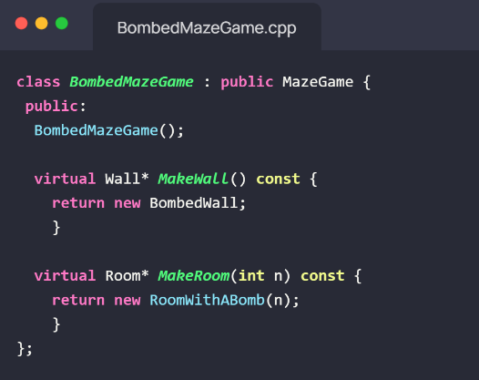
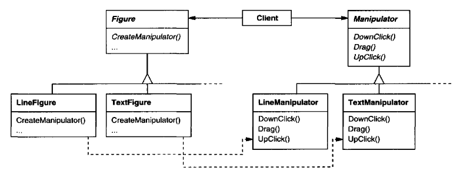

# Factory Pattern

## Descripción básica del patrón
El patrón Factory es un patrón de diseño creacional que se utiliza para crear objetos de manera que se abstrae el proceso de creación. En otras palabras, en lugar de crear objetos directamente en una clase cliente, se delega esta responsabilidad a una clase fábrica. De esta forma, se logra un acoplamiento más débil entre las clases y se facilita la creación de objetos con diferentes comportamientos y características.

## Conocido también como "Virtual Creator"
El patrón Factory también es conocido como "Virtual Creator" debido a que la responsabilidad de crear objetos se delega a una clase separada, lo que permite que los objetos sean creados de forma virtual. En lugar de instanciar directamente una clase, se hace a través de una interfaz que permite crear diferentes objetos.

## Clase Interfaz y clase abstracta en el patrón Factory
En el patrón Factory, se utilizan una clase Interfaz y una clase abstracta para abstraer el proceso de creación de objetos. La clase Interfaz se encarga de definir los métodos que deben ser implementados por las clases concretas que se encargan de crear objetos. La clase abstracta, por su parte, se encarga de definir la estructura base de la clase fábrica y de los objetos que esta clase crea.

## ¿Cuándo utilizar Factory Pattern?
El patrón Factory es útil cuando se necesita crear objetos que tengan diferentes comportamientos o características. También es útil cuando se necesita abstraer el proceso de creación de objetos para evitar un acoplamiento fuerte entre las clases de un sistema. Básicamente se utiliza con objetos que cumplan la definición de **similar, pero no el mismo**

## Aplicaciones del patrón
Según Gamma, Erich et.al. “Design Patterns”. Addison-Wesley, 1995, el patrón Factory tiene varias aplicaciones, entre ellas:

- Cuando una clase no puede anticipar la clase de objetos que debe crear.
- Cuando una clase delega la responsabilidad de la creación de objetos a una o varias clases auxiliares.
- Cuando una clase desea que sus subclases especifiquen los objetos que deben ser creados.

## Estructura y actores
La estructura básica del patrón Factory incluye los siguientes actores:

- Product: representa la clase abstracta o interfaz que define los métodos que deben ser implementados por las clases concretas que se encargan de crear objetos.
- ConcreteProduct: representa las clases concretas que implementan los métodos definidos por la clase Product.
- Creator: representa la clase abstracta o interfaz que define los métodos para crear objetos. Esta clase se encarga de abstraer el proceso de creación de objetos.
- ConcreteCreator: representa las clases concretas que implementan los métodos definidos por la clase Creator y que se encargan de crear objetos concretos.


## Ejemplo de Factory en Mediación Virtual


## Implementación

A la hora de implementar una aplicación con un patrón de diseño factory method, se deben tomar en cuenta las siguientes consideraciones:

### Dos variaciones

Hay dos principales variaciones a la hora de implementar el factory method:
1. Cuando la clase Creator es una clase abstracta, o sea, no tiene ninguna implementación por default del factory method.
2. Cuando la clase Creator sí es una clase concreta y provee un factory method por default.

### Factory methods con parámetros

Un factory method no necesita ser alterado con polimorfismo para especificar el tipo de producto concreto que quiere crear. Con la ayuda de los parámetros, el factory method puede decidir cuál producto concreto crear. Normalmente se pasa como parámetro un identificador que se relaciona con un producto concreto. Dentro del factory method existirá un switch (o serie de ifs) que evaluarán ese identificador y elegirán el producto concreto a crear.

```
// en este caso esto va dentro del Trivia.cpp, que es el controlador 
Question* Trivia::createQuestion(const std::string& type) { 
	if (type == "textual") { 
		return new TextualQuestion();
 	} else if (type == "numeric") { 
		return new NumericQuestion();
 	} else { 
		return nullptr; // opción por defecto
 	} 
}
```

### Variantes y problemas específicos al lenguaje

Dependiendo del lenguaje de programación, este patrón de diseño puede tener diferentes variaciones que pretenden enfrentar las limitaciones del lenguaje. Por ejemplo, en programas Smalltalk se pueden crear métodos que retornan clases, por lo que el factory method del Creator puede usar este valor para crear el producto concreto que desee. También podría almacenar este valor en la clase Creator, para así no tener que hacer una subclase Creator concreta y realizar la creación en la clase padre.


### El uso de templates para evitar subclases

Puede parecer que estamos forzados a hacer subclases solo para crear el producto concreto que se quiere. Pero por ejemplo, en c++, se puede utilizar templates para evitar esto.

```
class Creator {
public: 
  virtual Product* CreateProduct() = 0 ;
   }; 
template <class TheProduct>
class StandardCreator: public Creator {
public:
  virtual Product* CreateProduct();
}; 
template <class TheProduct> 
Product* StandardCreator::CreateProduct () { 
  return new TheProduct;
}
```

### Convenciones de nombrado

Siempre se debe utilizar buenas convenciones de nombrado a la hora de nombrar los factory methods. Usualmente el nombre tendrá el nombre del producto a crear junto con un verbo. Por ejemplo, si se quiere crear un nuevo producto carro (Car en inglés) el nombre del factory method puede ser createCar.

## Ejemplo

Supongamos que se quiere crear un juego llamado Maze Game. Este tiene varios elementos que lo componen (Maze, Room, Wall, Door). Ahora bien, también existen varias versiones de este juego, y con esto, también varias versiones de sus elementos.

### Creador y productos


### Creador concreto y productos concretos



## Consecuencias

### Malas

Como se mencionó anteriormente, una de las desventajas de utilizar el factory method es que el cliente tenga que crear una subclase del Creator solo para poder especificar el producto concreto que quiere. Esto no significa gran problema si ya se tenía planeado el uso de clases hijas del Creator, pero si no era así entonces es un paso de herencia extra que puede ser molesto a la hora de implementarse.

### Buenas

El uso de factory methods eliminan la necesidad de definir un método de creación para cada tipo de producto concreto que se piensa crear. Esto no solo permite que se escriba menos código, si no que permite que el código sea flexible.

Otra consecuencia buena es que los factory methods conectan jerarquías de clases paralelas. Las clases paralelas son clases cuya lógica y jerarquía es muy similar. Por ejemplo:



Como se puede observar, ambas jerarquías son lógicamente similares, en tanto que ambas se refieren a las figuras. Pero la jerarquía de la derecha es de manipuladores de esas figuras. Ahora bien, el factory method CreateManipulator define la conexión entre las dos jerarquías de clases. Establece qué clases pertenecen juntas.

## Relación con otros patrones

### Abstract factory

Usualmente es implementado con factory methods.

### Template methods

Como se mencionó anteriormente, es común encontrar factory methods dentro de un template.

