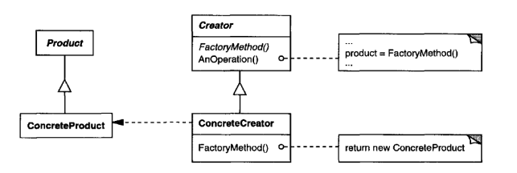
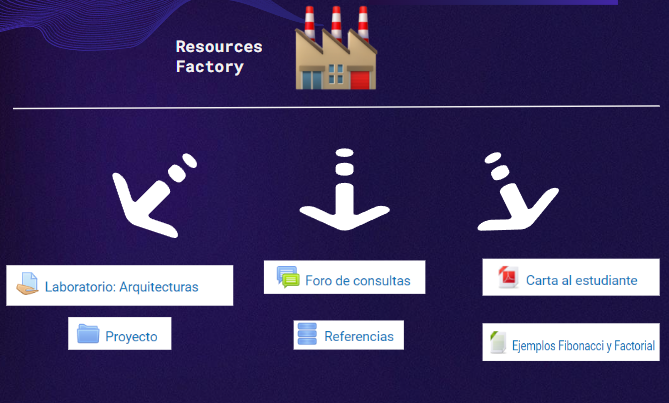

# Factory Pattern

## Descripción básica del patrón
El patrón Factory es un patrón de diseño creacional que se utiliza para crear objetos de manera que se abstrae el proceso de creación. En otras palabras, en lugar de crear objetos directamente en una clase cliente, se delega esta responsabilidad a una clase fábrica. De esta forma, se logra un acoplamiento más débil entre las clases y se facilita la creación de objetos con diferentes comportamientos y características.

## Conocido también como "Virtual Creator"
El patrón Factory también es conocido como "Virtual Creator" debido a que la responsabilidad de crear objetos se delega a una clase separada, lo que permite que los objetos sean creados de forma virtual. En lugar de instanciar directamente una clase, se hace a través de una interfaz que permite crear diferentes objetos.

## Clase Interfaz y clase abstracta en el patrón Factory
En el patrón Factory, se utilizan una clase Interfaz y una clase abstracta para abstraer el proceso de creación de objetos. La clase Interfaz se encarga de definir los métodos que deben ser implementados por las clases concretas que se encargan de crear objetos. La clase abstracta, por su parte, se encarga de definir la estructura base de la clase fábrica y de los objetos que esta clase crea.

## ¿Cuándo utilizar Factory Pattern?
El patrón Factory es útil cuando se necesita crear objetos que tengan diferentes comportamientos o características. También es útil cuando se necesita abstraer el proceso de creación de objetos para evitar un acoplamiento fuerte entre las clases de un sistema. Básicamente se utiliza con objetos que cumplan la definición de **similar, pero no el mismo**

## Aplicaciones del patrón
Según Gamma, Erich et.al. “Design Patterns”. Addison-Wesley, 1995, el patrón Factory tiene varias aplicaciones, entre ellas:

- Cuando una clase no puede anticipar la clase de objetos que debe crear.
- Cuando una clase delega la responsabilidad de la creación de objetos a una o varias clases auxiliares.
- Cuando una clase desea que sus subclases especifiquen los objetos que deben ser creados.

## Estructura y actores
La estructura básica del patrón Factory incluye los siguientes actores:

- Product: representa la clase abstracta o interfaz que define los métodos que deben ser implementados por las clases concretas que se encargan de crear objetos.
- ConcreteProduct: representa las clases concretas que implementan los métodos definidos por la clase Product.
- Creator: representa la clase abstracta o interfaz que define los métodos para crear objetos. Esta clase se encarga de abstraer el proceso de creación de objetos.
- ConcreteCreator: representa las clases concretas que implementan los métodos definidos por la clase Creator y que se encargan de crear objetos concretos.

## Ejemplo de Factory en Mediación Virtual

