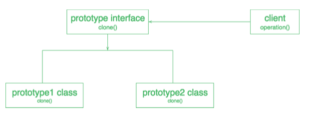

# PROTOTYPE

## Introducción:

El patrón Prototype pertenece a los patrones creacionales.
Uno de los mejores analogías que explican el patrón creacional de prototype es el de la mitosis celular. La mitosis es un proceso fundamental para la vida. Durante la mitosis, una célula duplica todo su contenido, incluyendo sus cromosomas, y se divide para formar dos células hijas idénticas.

## Problema: 

Describir en qué escenario o contexto en específico en donde tiene sentido utilizar este patrón, con ejemplo
Dada la complejidad de ciertos objetos, se vuelve necesario agregar un método de clonado. De esta manera, podemos obtener una copia del objeto, sin tener que crearlo nuevamente desde cero. Por ejemplo, para obtener el promedio ponderado en ematricula, un objeto de la super-clase Promedio, puede contener la lista de cursos con su respectiva nota, cuando se crea una instancia del mismo, se calcula el promedio iterando por todos los cursos y sus notas. Además, hay diferentes promedios (PromedioPonderadoAnual, PromedioPonderadoTotal, PromedioPonderadoParaMatrícula). Dado que esta operación resulta costosa, pues debe obtener todos los cursos de un estudiante y recorrerlos para hacer la operación matemática relacionada al promedio. Este escenario para un solo estudiante, una sola vez, no representa mayor problema. Sin embargo, en período de matrícula la cantidad de estudiantes accediendo a e-matrícula y consultando sus promedios e historial de los mismos se incrementa considerablemente. Las peticiones al servidor para obtener esta información incrementan considerablemente. De esta forma, la instanciación del objeto Promedio, sobrecarga al sistema debido a su alto costo. 

## Solución: 

Estructura de la solución incluyendo los elementos, sus relaciones, responsabilidad y colaboraciones. Además, vienen en formato de plantilla dado que no describen un diseño o implementación en particular.
Para evitar tener que invertir tanto tiempo para acceder a esta información, hacemos que las clases implementen una interfaz llamada Clonable, y cada vez que un estudiante solicite cualquier promedio, la primera vez que lo solicite se crea una instancia y se guarda en una estructura de datos que relacione la instancia del Promedio con un id (aka carne estudiantil y el nombre del promedio unidos). Con esto, la próxima vez que el usuario requiera de esta información el sistema de e-matrícula accederá un object Store (aka cache) que mantiene una instancia del promedio y que devuelve una copia del mismo al estudiante.

## Ejemplo de código:

El patrón de diseño de prototipos es uno de los patrones de diseño de creación, por lo que proporciona un mecanismo de creación de objetos.
El concepto es copiar un objeto existente en lugar de crear una nueva instancia desde cero, algo que puede incluir operaciones costosas. El objeto existente actúa como prototipo y contiene el estado del objeto (los detalles del objeto). El nuevo objeto copiado puede cambiar las mismas propiedades sólo si es necesario. Este enfoque ahorra costosos recursos y tiempo, especialmente cuando la creación de objetos es un proceso pesado.

El patrón Prototipo delega el proceso de clonación a los objetos que se están clonando. El patrón declara una interfaz común para todos los objetos que admiten la clonación. Esta interfaz le permite clonar un objeto sin acoplar su código a la clase de ese objeto. Normalmente, esta interfaz contiene un único método de clonación.

Un objeto que permite la clonación se denomina prototipo. Cuando tus objetos tienen docenas de campos y cientos de configuraciones posibles, clonarlos puede servir como alternativa a la subclase.
Una de las mejores formas disponibles para crear un objeto a partir de objetos existentes es el método clone(). Clonar es el enfoque más simple para implementar un patrón prototipo. Sin embargo, es usted quien debe decidir cómo copiar un objeto existente en función de su modelo de negocio.

Así es como funciona: se crea un conjunto de objetos, configurados de varias maneras. Cuando necesite un objeto como el que ha configurado, sólo tiene que clonar un prototipo en lugar de construir un nuevo objeto desde cero.

Participantes en el diseño de prototipos

1) Prototipo : Es el prototipo de un objeto real.
2) Registro de prototipos : Se utiliza como un servicio de registro para tener todos los prototipos accesibles utilizando simples parámetros de cadena.
3) Cliente : El cliente será responsable de utilizar el servicio de registro para acceder a las instancias del prototipo.

Supongamos que tenemos un objeto que carga datos de la base de datos. Ahora tenemos que modificar estos datos en nuestro programa varias veces, por lo que no es una buena idea crear el objeto utilizando la palabra clave new y cargar todos los datos de nuevo desde la base de datos. El mejor enfoque sería clonar el objeto existente en un nuevo objeto y luego hacer la manipulación de los datos. El patrón de diseño de prototipos exige que el objeto que se está copiando proporcione la función de copia. No debe ser realizada por ninguna otra clase. Sin embargo, el uso de la copia superficial o profunda de las propiedades del objeto depende de los requisitos y es una decisión de diseño. 
Una copia superficial crea un nuevo objeto que comparte algunos o todos los datos con el objeto original, mientras que una copia profunda crea un nuevo objeto con datos completamente nuevos que no se comparten con el objeto original. Esto significa que el nuevo objeto y el objeto original tienen referencias separadas a los objetos referenciados, de modo que si uno modifica el objeto, el otro no se verá afectado.
La elección entre una copia superficial o profunda depende de las necesidades específicas de su aplicación.

## Consecuencias: 
### Pros
- Puede clonar objetos sin acoplarlos a sus clases concretas.
- Puede deshacerse del código de inicialización repetido en favor de la clonación de prototipos prefabricados.
- Puede producir objetos complejos de manera más conveniente.
- Agregar y eliminar productos en tiempo de ejecución: los prototipos le permiten incorporar una nueva clase de producto concreto en un sistema simplemente registrando una instancia prototípica con el cliente. Eso es un poco más flexible que otros patrones de creación, porque un cliente puede instalar y eliminar prototipos en tiempo de ejecución. 
- Especificación de nuevos objetos mediante la variación de valores: los sistemas altamente dinámicos le permiten definir un nuevo comportamiento a través de la composición de objetos especificando valores para las variables de un objeto y no definiendo nuevas clases.
- Especificación de nuevos objetos por estructura variable: muchas aplicaciones crean objetos a partir de partes y subpartes. Por conveniencia, tales aplicaciones a menudo le permiten instanciar estructuras complejas definidas por el usuario para usar un subcircuito específico una y otra vez.
 
### Contras
- La clonación de objetos complejos que tienen referencias circulares puede ser muy complicada.
- Exagerado para un proyecto que usa muy pocos objetos y/o no tiene un énfasis subyacente en la extensión de cadenas de prototipos.
- Cada subclase de Prototype debe implementar la operación clone() que puede ser difícil. Además, implementar clone() puede ser difícil c cuando sus partes internas incluyen objetos que no admiten la copia o tienen referencias circulares.

## Implementación:
Use el patrón Prototype cuando su código no deba depender de las clases concretas de objetos que necesita copiar.
Esto sucede mucho cuando su código funciona con objetos que le pasan desde un código de terceros a través de alguna interfaz. Las clases concretas de estos objetos son desconocidas y no podrías depender de ellos aunque quisieras.

El patrón Prototype proporciona al código del cliente una interfaz general para trabajar con todos los objetos que admiten la clonación. 

Esta interfaz hace que el código del cliente sea independiente de las clases concretas de objetos que clona.
Utilice el patrón cuando desee reducir el número de subclases que solo difieren en la forma en que inicializan sus respectivos objetos.
Suponga que tiene una clase compleja que requiere una configuración laboriosa antes de que pueda usarse. Hay varias formas comunes de configurar esta clase y este código se encuentra disperso en su aplicación. Para reducir la duplicación, crea varias subclases y coloca cada código de configuración común en sus constructores. Resolvió el problema de la duplicación, pero ahora tiene muchas subclases ficticias.

El patrón de prototipo permite usar un conjunto de objetos preconstruidos configurados de varias maneras como prototipos. En lugar de instanciar una subclase que coincida con alguna configuración, el cliente puede simplemente buscar un prototipo apropiado y clonarlo.
Uso del patrón de prototipo:
- Cuando las clases se instancian en tiempo de ejecución.
- Cuando el costo de crear un objeto es caro o complicado.
- Cuando desee mantener el número de clases en un mínimo de aplicación.
- Cuando la aplicación cliente necesita ignorar la creación y representación de objetos.

## Relación con otros patrones:

Muchos diseños comienzan usando Factory Method (menos complicado y más personalizable) y evolucionan hacia Abstract Factory, Prototype o Builder (más flexible, pero más complicado).

Las clases de Abstract Factory a menudo se basan en un conjunto de Factory Methods, pero también se puede usar Prototype para componer los métodos en estas clases.

Los diseños que hacen un uso intensivo de Composite y Decorator a menudo pueden beneficiarse del uso de Prototype. La aplicación del patrón le permite clonar estructuras complejas en lugar de reconstruirlas desde cero.
Prototype pueden implementarse como Singletons.

## Conclusión:
Las principales ventajas del patrón prototipo son las siguientes:
- Reduce la necesidad de subclasificación.
- Oculta las complejidades de la creación de objetos.
- Los clientes pueden obtener nuevos objetos sin saber qué tipo de objeto será.
- Le permite agregar o eliminar objetos en tiempo de ejecución.

## Referencias:
