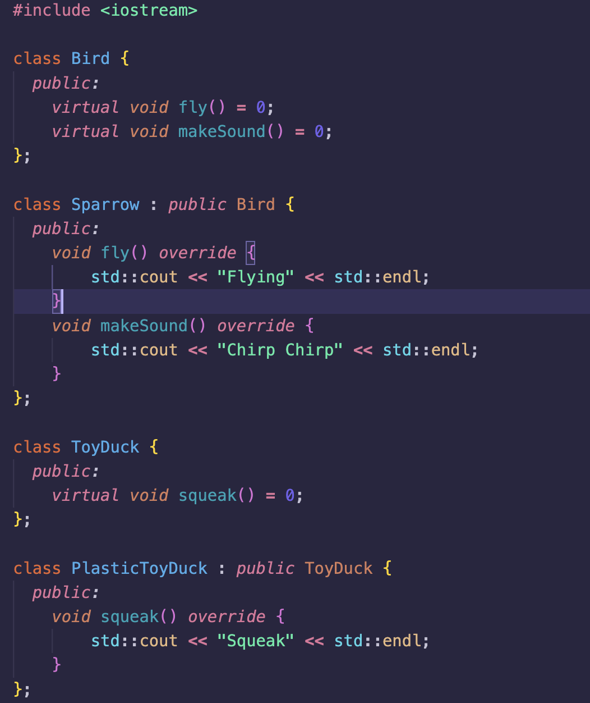
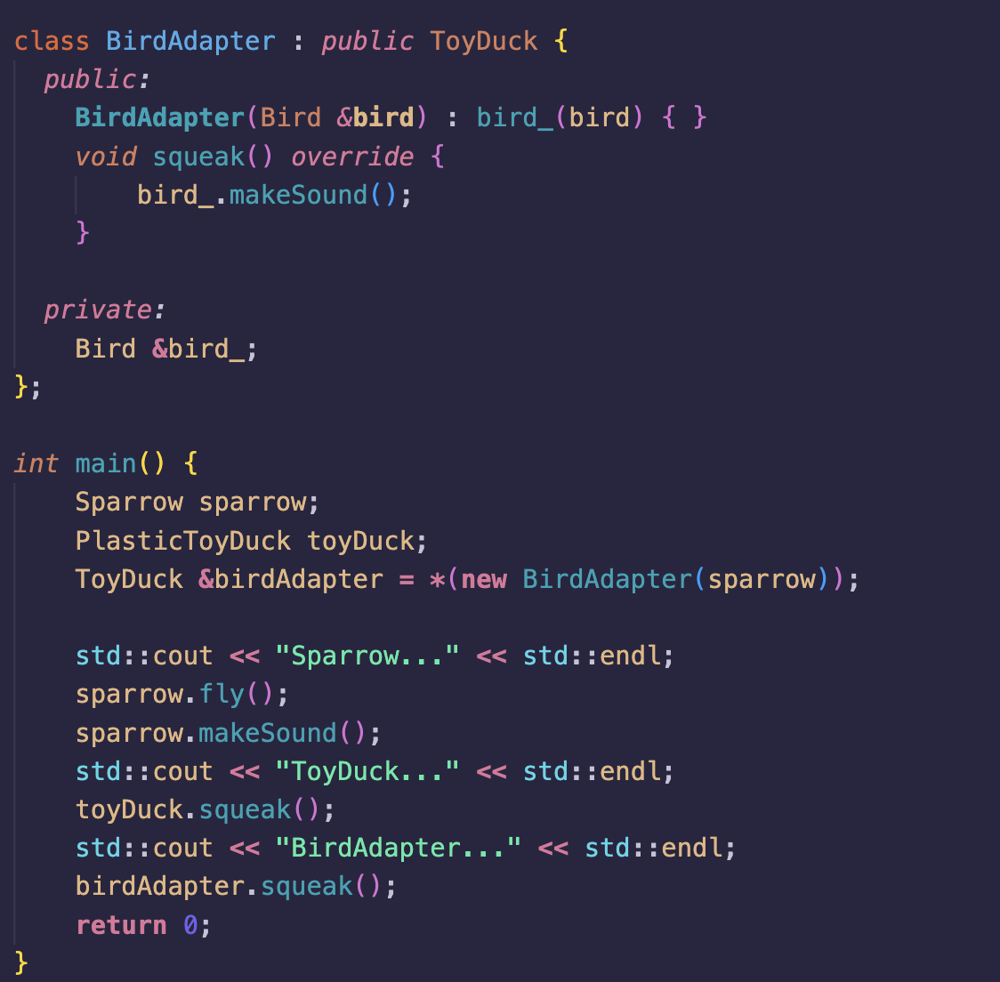
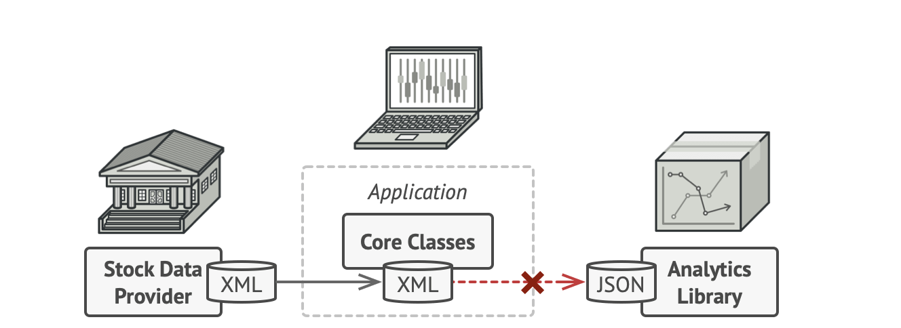
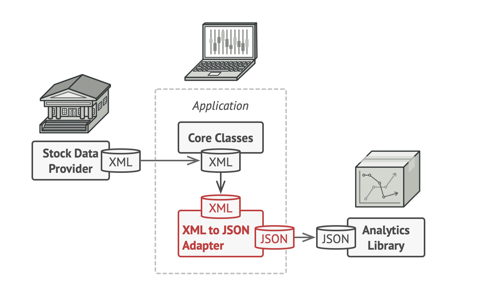

# Patrón de diseño Adapter

## Hecho por:

- Daniel Lizano Morales C04285
- Esteban Rodrigo Castañeda Blanco C01795

## Concepto y propósito

Patrón que convierte la interfaz de una clase a
otra interfaz que compatible con la estructura
del proyecto

Involucra una sola clase que es responsable
de unir funcionalidades de interfaces
independientes o incompatibles, combiando la
capacidad de dos interfases independientes

Tiene como principal propósito permitir la
colaboración entre objetos que poseen
interfases incompatibles

## Analogía

Imaginemos que tenemos que ir al extranjero. Especificamente a Italia, aunque despues de Italia iremos a Inglaterra. Cuando llegamos a Milán e intentamos cargar nuestro teléfono vemos que no podemos cargarlo ya que el enchufe es diferente al que usamos en América asi que decidimos bajar y comprar un cargador de teléfono nuevo.

Después de ello subimos al cuarto del hotel y cargamos el teléfono. Una semana después tomamos un vuelo a Londres y cuando llegamos al hotel intenatamos cargar el teléfono nuevamente, pero nos damos cuenta qeu otra vez no podemos cargarlo debido a que ele enchufe no es del mismo tipo que el italiano así que debemos de bajar a comprar un cargador nuevo otra vez. 

Mas adelante unos cuantos meses después volveremos a viajar, pero esta vez decidimos comprar un adaptador universal que nos permita poder cargar uestro telefono en una gran variedad de paisas y enchufes. 

## Problema

****Implementar una biblioteca que utiliza el formato
JSON en un sistema que utiliza XML****

Solución:

Crear adaptadores de XML a JSON para cada
clase de la biblioteca de análisis con la que
trabaje tu código directamente. Después
ajustas tu código para que se comunique con
la biblioteca únicamente a través de estos
adaptadores
********

## Ventajas y desventajas

### Ventajas:

- **Principio de responsabilidad único**
    - Se puede separar la intrerfaz o el código de la conversión de datos de la lógica.
- **Principio de abierto/cerrado**
    - Se puede introducir nuevos tipos de adaptadores al programa sin descomponer el código cliente existente, siempre y cuando trabajen con los adaptadores a través de la interfaz con el cliente.

### Desventajas:

- **Overhead saturado**
    - Al ser todas las request dirigidas se causa un crecimiento en el overhead del programa.
- **Varias adaptaciones**
    - Dependiendo de los requeriemientos del sistema varias adaptaciones pueden ser requeridas por lo que se debe tener una cadena de adaptación larga.

## Cuando aplicarlo

Cuando se requiera utilizar una clase existente pero su
interfaz no es compatible con el resto del código.

Cuando se desee reutilizar varias subclases existentes que
carecen de alguna funcionalidad común que no se puede
agregar a la superclase.

## Implementación

1. Asegurarse de tener al menos dos clases con interfaces
incompatibles.
2. Declarar la interfaz del cliente y describir cómo los clientes
se comunican con el servicio.
3. Crear la clase de adaptador y hacer que siga la interfaz del
cliente.
4. Agregar un campo a la clase de adaptador para almacenar
una referencia al objeto de servicio.
5. Implementar los métodos de la interfaz del cliente en la
clase de adaptador. El adaptador debe delegar la mayor
parte del trabajo real al objeto de servicio, manejando solo
la interfaz o la conversión de formato de datos.
6. Los clientes deben usar el adaptador a través de la interfaz
del cliente. Esto le permitirá cambiar o extender los
adaptadores sin afectar el código del cliente.

## Ejemplo en C++

## Consecuencias de la implementacion:

- Se logra la interoperabilidad entre sistemas o componentes cuyas interfaces no son
compatibles
- Se logra hacer que el código sea flexible y reutilizable ya los objetos existentes se pueden aplicar a contextos nuevos sin necesidad de modificarlos
- Puede disminuir el rendimiento del sistema porque el uso de adaptadores puede
generar una sobrecarga en el código
- Vuelve el código más complejo lo que dificulta su mantenibilidad

## Problema de la vida real

En el problema de la vida real tenemos la comlicacion de un archivo en formato XML cuando lo ocupamos en JSON.

### XML a JSON

Asi que para poder solucionar este problema haremos uso de un adaptador, esto hara que el formato del archivo sea compatible con la biblioteca de análisis de datos.

### XML CON ADAPTER

## Diagramas

En el diagrama de clases podemos ver un diagrama simple que muestro como es que sirve una implementación sencilla de adapter basada en el caso anteriormente mencionado de XML a JSON.

## Referencias

Adapter. (2022, enero 1). Refactoring.Guru. https://refactoring.guru/design-patterns/adapter

Design Patterns - Adapter Pattern. (s/f). Tutorialspoint.com. Recuperado de
https://www.tutorialspoint.com/design_pattern/adapter_pattern.html

Kean, K. (2023, enero 29). What is the adapter design pattern and how can you use it? MUO.
https://www.makeuseof.com/adapter-design-pattern-what-how-use/