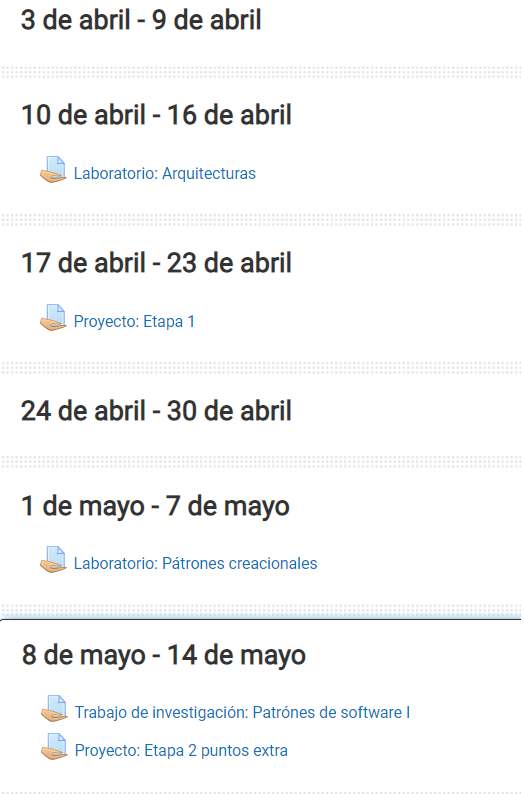
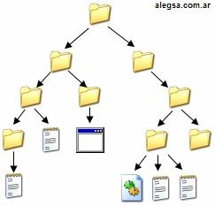
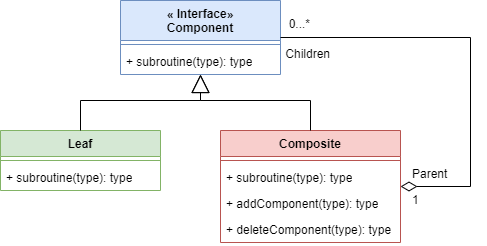

# Patrón Composite

Estudiantes:

- Julio Rodroguez Salguera C16717
- Geancarlo Rivera Hernández C06516

## Problema

Este patrón es muy útil cuando nuestros elementos poseen una estructura jerárquica entre ellos, dado que captura la esencia de la composición recursiva en términos orientados a objetos, ya que permite almacenar grupos de elementos complejos y simples en un mismo objeto, lo que se puede representar como una estructura de árbol. Esto posibilita simplificar el diseño y volver más conciso el código de una clase compleja, gracias a la modularidad que ofrece este patrón y la funcionalidad de poder tratar objetos individuales y compuestos de forma uniforme. (Haythornwaite, 2002, p. 163).

Un ejemplo familiar sobre la funcionalidad y utilidad de este patrón se da en la plataforma virtual “Mediación Virtual” de la Universidad de Costa Rica, específicamente con la funcionalidad de las secciones de los cursos virtuales, los cuales separan los recursos de forma física y lógica según temas (**figura 1**), fechas (**figura 2**), importancia o funcionalidad (**figura 3**). Estas secciones pueden contener una cantidad indefinida de recursos, como archivos o evaluaciones, y si una acción es realizada sobre la sección, puede ser transmitida a todos los recursos que este contiene, como por ejemplo, si este es ocultado, todos los recursos también desaparecerán. Además, estas secciones pueden contener carpetas de recursos (**figura 4**), por lo que si la sección es eliminada, la carpeta eliminará recursivamente todos sus contenidos. Este ejemplo muestra cómo el patrón composite puede simplificar el diseño y hacer más conciso el código de una clase compleja, lo que permite tratar objetos individuales y compuestos de forma uniforme.

**Figura 1: Secciones divididas por tema**

**Figura 2: Secciones divididas por fecha**

**Figura 3: Secciones divididas por función**

**Figura 4: Carpetas de recursos de Mediación Virtual**

Uno de los ejemplos más claros de este patrón son los sistemas de almacenamiento por carpetas y archivos; Al crear una carpeta, esta se encuentra vacía, pero dentro de ella se pueden crear un archivos o más carpetas como el mostrado en la (**figura 5**), por lo que las carpetas funcionan como un objeto “contenedor”. Por otra parte, los archivos no pueden contener carpetas ni otros archivos dentro de ellos, convirtiéndolos en objetos “hoja”. Esta facultad de poder almacenar recursivamente objetos contenedores unos dentro de otros de forma indefinida y sencilla forma un árbol recursivo, lo que es una característica importante del patrón. Sumado a esto, otra capacidad que tiene el patrón Composite es la de simplificar el llamado a subrutinas heredadas, pues este llamado sólo debe realizarse para el componente contenedor más alto en la jerarquía (objeto padre/raíz), pues este se encarga de pasar el mensaje a sus contenidos (objetos derivados/hijos). Por ejemplo, cuando se elimina una carpeta, esta llamará a su subrutina de borrado para cada uno de sus elementos internos y estos a su vez llamarán a sus propias subrutinas de borrado recursivamente. (El patrón Composite: ejemplos de soluciones para jerarquías parte-todo, 2020).

**Figura 5: Estructura de carpetas y archivos**

## Solución

El patrón Composite utiliza y se basa en tres componentes principales para definir e implementar su estructura, que pueden ser observados en el diagrama UML de la **Figura 6**:

**Figura 6: Diagrama UML del patrón Composite**

### Component 🧰

Esta clase declara la interfaz de la cual van a heredar los objetos en la composición, es decir, *Leaf* y *Composite*. Además, es el responsable de implementar el comportamiento predeterminado para la interfaz común a todas las clases, las cuales deben implementarlo según corresponda. Declara una interfaz para acceder y administrar sus componentes secundarios y de forma opcional, puede  definir también una interfaz para acceder al padre de un componente en la estructura recursiva y la implementa si es apropiado. (Haythornwaite, 2002, p. 165).

### Composite 🛍️

Esta clase hereda de *Component* y es donde se encuentra la mayor lógica del patrón ya que define el comportamiento de los componentes que tienen hijos, puede almacenar una cantidad indefinida de componentes secundarios que hereden de la clase *Component*, teniendo la posibilidad de almacenar objetos de su mismo tipo *Composite* formando una composición recursiva. Es común que esta clase implemente una estructura de datos para guardar estos objetos de la composición. Además, esta clase debe implementar las operaciones o subrutinas relacionadas a los hijos definidas en la interfaz *Component*. (Haythornwaite, 2002, p. 165).

### Leaf 🍃

Esta clase también hereda de *Component* y representa los objetos hoja en la composición, definiendo el comportamiento de estos objetos primitivos, los cuales heredan las subrutinas necesarias de *Component* e implementan su propia versión de estas en caso de que no puedan utilizar la ya definida por *Component*. Estos objetos pueden, y normalmente están contenidos en un objeto *Composite*, además un cliente puede llamar a sus métodos individualmente. Cabe destacar que al ser una clase hoja, representan la clase más baja de la jerarquía por lo que no pueden contener otras clases que hereden de esta. (Haythornwaite, 2002, p. 165).

### Client 🧑‍💻

Más que una clase es un cliente que manipula los objetos de la composición a través de la interfaz *Component*. Si hace el llamado a un componente Leaf, este realizará la acción individualmente, pero si lo hace con un *Composite*, este hará el llamado recursivo a todos los objetos que formen parte de esa composición.

Lo anterior se puede ejemplificar con un sistema de archivos y directorios, en el que si por ejemplo, un usuario elimina un archivo (representando un objeto *Leaf*), este se eliminará individualmente, pero si elimina una carpeta (representando un objeto *Composite*) entonces esta llamará a eliminar recursivamente todos los archivos y subcarpetas dentro de ella.

***

## Ejemplo de código

Para comprender mejor la implementación y funcionalidad del patrón, puede observar el código de ejemplo que se encuentra en la carpeta [src](/src/) , que contiene el ejemplo de secciones y carpetas de la plataforma Mediación Virtual.
Además puede observar el siguiente ejemplo correspondiente al main del código: [Ejemplo de Código](./src/Main.java)

***

## Consecuencias

Este patrón presenta principalmente las siguientes consecuencias:

Define jerarquías de clases que consisten en objetos primitivos y objetos compuestos. Los objetos primitivos se pueden componer en objetos más complejos, que a su vez se pueden componer, y así sucesivamente de forma recursiva. Siempre que el código del cliente espera un objeto primitivo, también puede tomar un objeto compuesto.

Simplifica la interacción a los clientes, ya que pueden tratar estructuras compuestas y objetos individuales de manera uniforme. Los clientes normalmente no saben (y no debería importarles) si se trata de una hoja o de un componente compuesto. Esto simplifica el código del cliente, porque evita tener que escribir funciones de estilo de declaración de caso y etiqueta sobre las clases que definen la composición.

Hace que sea más fácil agregar nuevos tipos de componentes. Las subclases Composite u Leaf recién definidas funcionan automáticamente con las estructuras existentes y el código del cliente. No es necesario cambiar los clientes para las nuevas clases de componentes.

Puede hacer que un diseño sea muy general. La desventaja de facilitar la adición de nuevos componentes es que dificulta la restricción de los componentes que forman la composición. A veces se desea que una composición tenga solo ciertos componentes. Esto puede requerir verificaciones en tiempo de ejecución para asegurarse de que se cumplan ciertas restricciones en la estructura de la composición o compuesto.

***

## Implementación

Según Haythornwaite (2002), hay varias consideraciones que debemos tomar en cuenta a la hora de implementar el patrón Composite:

1. Tener referencias explícitas a las clases padre. Mantener referencias desde los componentes hijos a su padre puede simplificar la navegación y gestión de una estructura compuesta. La referencia al padre simplifica la subida entre la estructura jerárquica y la eliminación de un componente. El lugar habitual para definir la referencia al padre es en la clase Component. Las clases Leaf y Composite pueden heredar la referencia y las operaciones que la gestionan, lo cual ayuda a mantener la Cadena de Responsabilidades.
Con las referencias al padre, es esencial mantener la constante de que todos los hijos de un compuesto tengan como padre el compuesto que, a su vez, los tiene como hijos. La forma más fácil de garantizar esto es cambiar el padre de un componente sólo cuando se está agregando o eliminando del compuesto. Si esto se puede implementar una vez en las operaciones Agregar y Eliminar de la clase Composite, entonces se puede heredar por todas las subclases y la invariante se mantendrá automáticamente. (p. 166).

2. El patrón Composite permite construir estructuras complejas de objetos. A veces, se desea compartir componentes entre diferentes partes de la estructura para ahorrar espacio en memoria. Pero, cuando un componente puede tener solo un padre, se vuelve difícil compartirlo.
Una solución es que los hijos puedan tener varios padres, pero esto puede causar problemas y ambigüedades en la estructura.(pp. 166-167).

3. Maximizar la interfaz Componente. Uno de los objetivos del patrón Composite es hacer que los clientes no estén conscientes de las clases específicas Leaf o Composite que están utilizando. Para lograr este objetivo, la clase Component debe definir tantas operaciones comunes como sea posible para las clases Composite y Leaf.
La clase Component generalmente proporciona implementaciones por defecto para estas operaciones, y las subclases Leaf y Composite las utilizan o hacen su propia implementación (override) según sea necesario. Esto permite que el cliente utilice cualquier componente sin necesidad de conocer su tipo específico.

4. Declaración de operaciones de gestión de hijos o clases derivadas: Si se desea una jerarquía de clases muy flexible y general, las operaciones de gestión de hijos (Agregar, Eliminar, Obtener, …) deben declararse en la clase Component. Si se desea una jerarquía de clases más rígida y específica, estas operaciones deben declararse y definirse sólo en la clase Composite y sus subclases. (p.167).
   - Si se define la gestión de hijos en la clase Component, podemos tratar a todas las clases Component de manera uniforme, lo que nos da transparencia, pero también puede llevar a que los clientes intenten agregar o eliminar objetos de hojas (Leaf) de manera inútil.
   - Si se define en la clase Composite se gana seguridad, ya que cualquier intento de agregar o eliminar objetos de hojas será detectado en tiempo de compilación en lenguajes con análisis estático como C++, pero perdemos transparencia porque las hojas y los compuestos tienen interfaces diferentes. Si opta por la seguridad, a veces puede perder información de “tipo” teniendo que convertir un Component en un Composite por lo que se perdería la transparencia y el trato uniforme a todos los objetos, debido a este trato diferente entre tipos.

5. La clase Component no debería implementar una lista de componentes. Es posible que sienta la tentación de definir el conjunto de hijos como una variable de instancia en la clase Component donde se declaran las operaciones de acceso y gestión de hijos. Pero poner el puntero de hijo en la clase base incurre en una penalización de espacio para cada hoja, aunque una hoja nunca tenga hijos. Esto solo vale la pena si hay relativamente pocos hijos en la estructura. (p. 169).

6. Ordenamiento de los hijos. Muchos diseños especifican un ordenamiento en los hijos de Composite, por ejemplo, si los composites representan árboles de análisis sintáctico, entonces las declaraciones compuestas pueden ser instancias de un composite cuyos hijos deben ordenarse para reflejar el programa. Cuando el ordenamiento de los hijos es un factor en la implementación, se deben diseñar cuidadosamente las interfaces de acceso y gestión de los hijos para manejar su secuencia. (p. 169).

7. Se podría implementar una estructura tipo caché en la clase Composite para mejorar rendimiento. Si se necesita navegar o buscar composiciones con frecuencia, la clase Composite puede almacenar en caché información de búsqueda o recorrido sobre sus hijos. El Composite puede almacenar en caché resultados reales o simplemente información que le permita acortar el recorrido o la búsqueda. (p. 169).

8. La clase Composite debería ser la responsable de eliminar a sus hijos cuando ésta se destruya, aunque una excepción a esta regla es cuando los objetos Leaf son inmutables (no pueden ser modificados una vez se crean) y por tanto pueden ser compartidos. (p. 169).

9. Existen varias opciones para elegir la mejor estructura de datos para almacenar componentes en un Composite. Algunas opciones incluyen listas enlazadas, árboles, matrices y tablas hash, y la elección depende de la eficiencia requerida. Además, es posible que un Composite no requiera una estructura de datos general y, en su lugar, pueda tener una variable para cada hijo, aunque esto requeriría que cada subclase de Composite implemente su propia interfaz de gestión. (p. 170).

***

## Relación

Sobre la relación entre patrones Haythornwaite (2002), propone que el patrón Composite podría relacionarse con los siguientes patrones (p.173):

- Decorator se usa a menudo con Composite, cuando esto ocurre generalmente tendrán una clase principal común. Por lo tanto, Decorator debería admitir la interfaz de componentes con operaciones como Add, Remove y getChild que ofrece el patrón Composite.

- Flyweight: Estos dos patrones también se usan juntos frecuentemente, ya que Composite le permite implementar una estructura lógicamente jerárquica en términos de un gráfico acíclico dirigido con nodos hoja compartidos.

- Iterator:  Se puede utilizar con Composite para hacer “traverse” compuestos.
*Traverse: Se refiere a recorrer o visitar cada nodo en una estructura de datos, como un árbol o una lista enlazada, en un orden específico.

- Visitor: Se puede combinar con Composite, ya que localiza las operaciones y el comportamiento que, de otro modo, se distribuirán en las clases compuestas y hoja. Visitor aplica operaciones sobre una estructura objeto definida por el patrón Composite.

***

## Referencias

Haythornwaite, C. (2002). Gamma, E., Helm, R., Johnson, R. & Vlissides, J. Design Patterns: Elements of Reusable Object Oriented Software. New York: Addison-Wesley, 1995. ADDISON-WESLEY. [http://www.javier8a.com/itc/bd1/articulo.pdf](http://www.javier8a.com/itc/bd1/articulo.pdf)

El patrón Composite: ejemplos de soluciones para jerarquías parte-todo. (2020, 11 septiembre). IONOS Digital Guide. [https://www.ionos.es/digitalguide/paginas-web/desarrollo-web/patron-composite/](https://www.ionos.es/digitalguide/paginas-web/desarrollo-web/patron-composite/)

Project Management Institute, Inc (ed.) The composite pattern. [https://www.pmi.org/disciplined-agile/the-design-patterns-repository/the-composite-pattern](https://www.pmi.org/disciplined-agile/the-design-patterns-repository/the-composite-pattern)

Design patterns - composite pattern Tutorials Point. [https://www.tutorialspoint.com/design_pattern/composite_pattern.htm](https://www.tutorialspoint.com/design_pattern/composite_pattern.htm)

Composite design pattern (2021) GeeksforGeeks. [https://www.geeksforgeeks.org/composite-design-pattern/](https://www.geeksforgeeks.org/composite-design-pattern/)

## Anexo 1

Si desea ver la presentación del patrón, vea: [Presentación Patrón Composite](/ppt/Patr%C3%B3n%20Composite.pdf)
