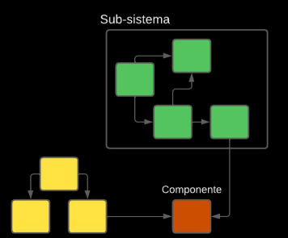

# Facade



## Descripción
Facade es un patron de software que simplifica el acceso a un sub sistema en un programa, donde el codigo cliente de este sub sistema en vez de usar los distintos componentes del sistema directamente, utiliza una "Fachada" la cual representa todo el sub sistema, lo que es capaz de convertir multiples lineas de inicializacion, orquestracion y manejo de dependencias, en un simple llamado a una funcion

# Qué soluciona
* Subsistemas complejos
* Programas monolíticos
* Mal escalado de código.


## Beneficios
Facade en el desarrollo de software es algo muy importante para hacer codigo 
* Entendible
* Cohesivo
* Desacoplado
* Escalable
Las razones por las que estos beneficios se cumplen son por:
* Dar una estructura sencilla
* Permitir concentrar las funcionalidades de un mayor nivel en la Fachada 
* Ser el unico componente que interactua con el codigo cliente
* Mantener los cambios en el sub sistema y no cada vez que un codigo cliente utilizo algunos componentes del sub sistema

### Diferencia entre Facade y API
Si bien las API y el patron Facade se parecen, no significa que sean lo mismo, siendo concretos, Facade solo se encarga de agrupar un subsistema en una clase y hacerse cargo de todas sus funciones, mientras que una API (Application **Programming** Interface), se encarga de mucho mas, porque necesita definir la interaccion con un programa externo, esto se traduce a definir protocolos de interaccion, reglas y las funciones con las que dispone el otro programa
Una API puede contener un Facade pero no viceversa

## Perjuicios de Facade
Estos son posibles perjuicios que Facade puede ocasionar en el codigo dependiendo de la implementacion, causando mas problemas que soluciones, estos son:
* Funcionalidad limitada

Ya que Facade ahora se encarga de interactuar con el codigo cliente unicamente, la variedad de funciones que el sub sistema ofrecia es reducida sustancialmente, como en sub sistemas que no siguen una secuencia normal de funcionamiento
* Acoplamiento

Ya que el Facade es el unico que interactua con codigo cliente, este codigo tiene que acoplarse a lo que el Facade del sub sistema ofrezca y adaptarse a su modo de uso, donde si este modo de uso se cambia frecuentemente, se genera dificultad en el codigo
* Apertura de malas practicas

La simpleza por la que Facade se rige puede dar a pie una "creatividad peligrosa" por parte del desarrollador, donde ahora este Facade empieza a hacer funcionalidades extras que no le competen para cumplir su rol, o tambien implementar nuevas funciones directamente en el Facade en vez de un componente, bajando la cohesion del codigo

## Solución
Para implementar Facade en un sistema, lo primero es **identificar** los servicios de un sub sistema el cual un código cliente usa, y que estos servicios sean **altamente cohesivos** 

> Por ejemplo, para un **sistema de universidad**, se pueden tener servicios para un **estudiante**(código cliente), como **visualizar cursos**, **subir asignaciones** y **ver calificaciones**
> 
> 	Servicio de cursos
> 	
> 	Servicio de asignaciones
> 	
> 	Servicio de calificaciones
> 	
> Supongamos que cada servicio es una clase

Ahora, teniendo reunidos estos servicios con un buen grado de cohesión, se **crea una clase Facade** la cual va a contener todos estos servicios, y **él será el único que se encargará de usar las funciones de cada servicio**

En cuanto a las funciones que el Facade tendrá, estas serán básicamente usar las funciones de los servicios para ofrecer el mismo servicio que daba este sub sistema, de forma simplificada pero limitada, lo que puede ser algo bueno o malo, dependiendo de qué tan rígido el sub sistema sea de usar

> FacadeUniversidad va a contener:
> 
> 	Servicio de cursos
> 	
> 	Servicio de asignaciones
> 	
> 	Servicio de calificaciones
> 	
> Y cada servicio se organizan y usan para proporcionar la funcionalidad completa del sub sistema

Y con esto logramos obtener una clase que representa un sub sistema altamente cohesivo, y fácil de usar para cualquier código cliente(estudiante)

## Cuando utilizar Facade

El patrón Facade se debe utilizar cuando se desea simplificar la interacción con un sub-sistema complejo y proporcionar una interfaz unificada y fácil de usar para los clientes.
Casos: Cuando se tiene un sub-sistema complejo, cuando se busca una interfaz más intuitiva y fácil de usar, cuando se desea simplificar el mantenimiento.

## Cuando no utilizar Facade
Cuando se necesita un alto grado de flexibilidad, cuando el sub-sistema cambia con frecuencia, cuando se necesita acceso a funcionalidades avanzadas del subsistema.

## Ejemplo en código
Para la implementación, podemos seguir lo dicho en la Solución, el ejemplo de la Universidad, donde se tienen 3 servicios que hacen algo en específico y son parte de un sub sistema 

El leguaje que se uso para implementar el patrón fue C++
```C++
class CourseService {
    public:
    string availableCourses;
    
    CourseService() {
        availableCourses = "
        	Math
        	Science
        	Language
        	Literature
        	Sports";
    }

    string getAvailableCourses() {
        return availableCourses;
    }

    string enrollInCourse(string student, string courseId) {
        // Enroll student if course exists and is valid
        if (strutil::contains(this->availableCourses, courseId)) {
            stringstream result;
            result << "Student enrolled into " << courseId << " course correctly";
            return result.str();
        }
        // If not, return notice that student couldn't be enrolled
        return "Student not enrolled";
    }
};
```

El código de los siguientes servicios se simplifica porque sigue la misma lógica que el servicio anterior

```C++
class AssignmentService {    
    AssignmentService() {
        // CourseService initialization
    }

    string submitAssignment(string student, string courseId, string submission, CourseService& courseService) {
        // Submit assignment if course exists and is valid
        if (courseId in courseService.availableCourses) {
            stringstream result;
            result << "\t Assignment " << submission << " submitted correctly";
            return result.str();
        }
        // If not, return notice that student couldn't submit assignment
        return "Assignment not submitted";
    }
};

class GradeService {
    GradeService() {
    }

    string getGradesForCourse(string  student, string courseId, CourseService& courseService) {
        // Student passed if course exists and is valid
        if (courseId in courseService.availableCourses)) {
            return "Student passed :)";
        }
        // If not, student didn't pass
        return "Student did not pass ;(";
    }
};

```

Y así tenemos definidos nuestros servicios, como clases, y estas clases pueden necesitar otros servicios para funcionar, como el "courseService" que es necesitado por los otros 2 servicios, y además estos servicios cumplen funciones bien definidas y no hacen cosas que no les competen, cumpliendo cohesividad
Y lo último que queda es unir estas clases en una sola la cual **controlará todos estos servicios el sólo y brinda el servicio del sub sistema total**

```C++
class CourseSystemFacade {

    CourseService* courseService;
    AssignmentService* assignmentService;
    GradeService* gradeService;

    public:

    string user;

    CourseSystemFacade(string user) {
        this->user = user;
        this->courseService = new CourseService();
        this->gradeService = new GradeService();
        this->assignmentService = new AssignmentService();
        // ... other services
    }

    string getAvailableCourses() {
        return this->courseService->getAvailableCourses();
    }

    string enrollInCourse(string courseId) {
        return this->courseService->enrollInCourse(this->user, courseId);
    }

    string getGradesForCourse(string courseId) {
        return this->gradeService->getGradesForCourse(this->user, courseId, *this->courseService);
    }

    string submitAssignment(string assignmentId, string submission) {
        return this->assignmentService->submitAssignment(this->user, assignmentId, submission, *this->courseService);
    }

    // ... other simplified methods for interacting with the system
};
```

Esta clase Facade funciona teniendo un estudiante, el cual simula ser el código cliente también que usa el sub sistema, es entonces donde cualquier función de los 3 servicios ya no se hace llamando a los servicios directamente, sino que se llama al Facade y la función que cumpla la misma funcionalidad que la que se tenía antes, y muchas más funciones, gracias a lo fácil que es ahora añadir funciones sin temor al **acoplamiento entre el código cliente y el sub sistema**

# Relación con los principios SOLID
El patrón Facade se relaciona con el principio de responsabilidad única, ya que permite que cada sub-sistema complejo tenga una única responsabilidad y se encargue de realizar sus tareas específicas. Además, se relaciona con el principio de abierto/cerrado, ya que permite que el código cliente no se vea afectado por los cambios en el sub-sistema, ya que el Facade se encarga de realizar las modificaciones necesarias. Por último, se relaciona con el principio de sustitución de Liskov, ya que el Facade permite que el código cliente pueda utilizar los sub-sistemas de forma transparente, sin importar el sub-sistema que se esté utilizando.

# Patrones relacionados
* Composite
* Decorator
* Proxy
