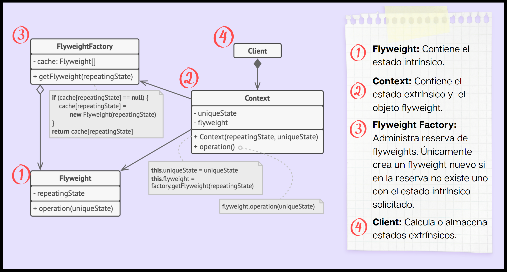
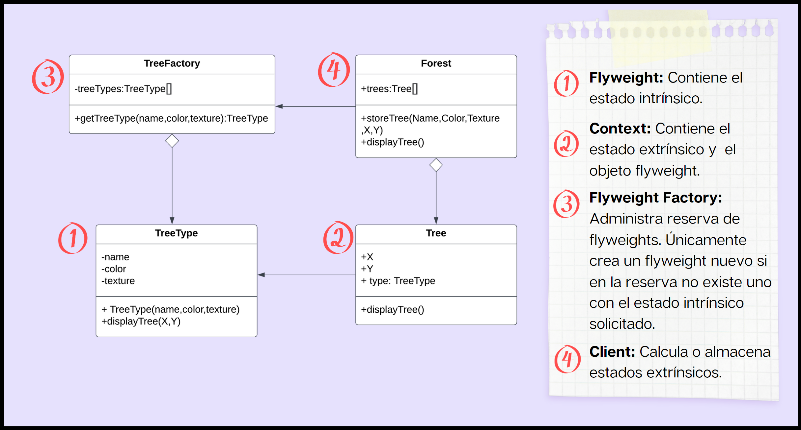
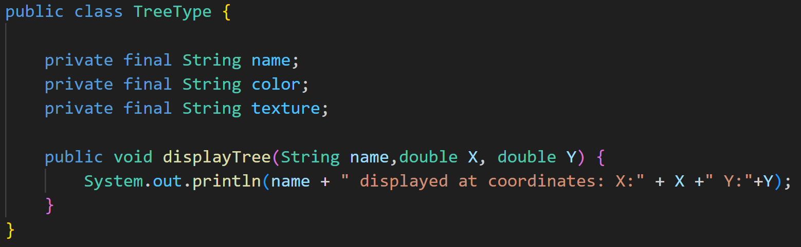
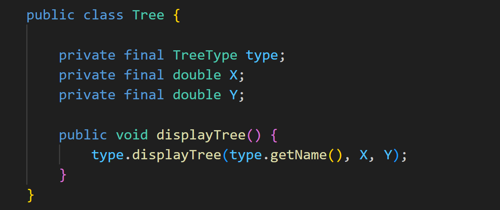
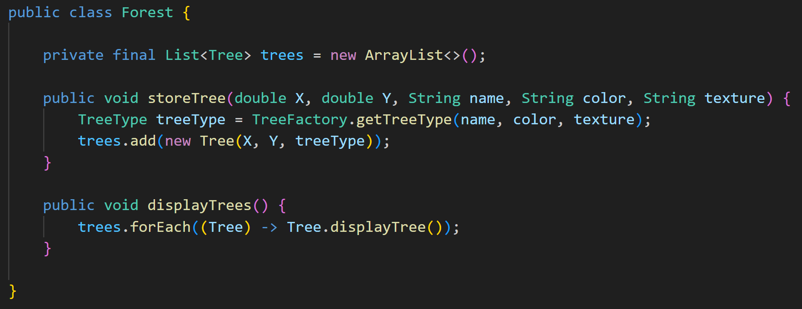

# Patrón Flyweight

* Luis Diego Barrantes B70994
* Francisco Mora Díaz C05118

Presentación PDF: [Flyweight Pattern](./flyweight_pattern.pdf)

## Problema
En la creación de aplicaciones de software, el manejo eficiente de memoria es una de las principales metas, lograrla se vuelve un desafío cuando se lidia con un gran número de objetos. Sin una estrategia efectiva que contemple los atributos contextuales de cada objeto, la creación y manipulación de estos puede conducir a saturación de memoria, un rendimiento lento y caídas de sistema.

## Solución
El patrón Flyweight es un patrón de diseño que se utiliza para optimizar el uso de memoria en aplicaciones con un gran número de objetos similares. Su objetivo principal es reducir la redundancia y minimizar el consumo de memoria almacenando datos compartidos entre múltiples objetos en un objeto compartido centralizado llamado "flyweight". El patrón flyweight es un patrón estructural, lo que significa que busca una forma de restructurar la información que ya está presente en vez de agregar nueva información. Lo qué se hace en Flyweight es buscar los atributos cada familia de objetos y organizarlos en 2 estados.

## Estados

**Estados en el patrón Flyweight**

El estado intrínseco son los atributos comunes qué se comparten entre los objetos de una misma familia y el estado extrínseco son los atributos que son propios de cada instancia de un objeto ya que dependen de su contexto específico.

## Flyweight

La clase Flyweight es donde se almacena el estado intrínseco de una familia de objetos y este es independiente al contexto. Solo es necesario crear una instancia de la clase flyweight por cada familia de objetos qué se utilicen los mismos datos intrínsecos.

## Estructura

**Estructura del patrón flyweight (Diagrama de refactoring.guru: https://refactoring.guru/images/patterns/diagrams/flyweight/structure.png?id=c1e7e1748f957a4792822f902bc1d420)**

1.  **Flyweight:** Contiene estado intrínseco que puede ser compartido entre múltiples objetos. Puede ser utilizado en diferentes contextos.  Usualmente contempla el comportamiento del objeto original (no dividido en estados), este recibe en sus parámetros el estado extrínseco.
 
2.	**Contexto:** Representa el objeto completo al contener el estado intrínseco y el objeto flyweight.
	
3.	**FlyweightFactory:** Pensado para utilizar por el cliente. Este maneja y administra la reserva de flyweights. Crea nuevos flyweights únicamente cuando no exista uno con los mismos atributos solicitados en reserva.

4.	**Client:** Usa el FlyweightFactory, calcula o almacena los estados extrínsecos.

## Estructura del ejemplo
En este ejemplo se descompone el objeto **“Árbol”** en estados intrínseco y extrínseco.

**Estructura del ejemplo de patrón Flyweight**

1.	**Flyweight (TreeType):** El estado intrínseco está compuesto por Nombre, Color y Textura. El método displayTree(X,Y) recibe coordenadas para dibujar el árbol en el mapa, estas coordenadas son el estado extrínseco.

2.	**Contexto(Tree):** El objeto Tree contiene el estado extrínseco (coordenadas) y un flyweight; formando así un objeto completo.

3.	**FlyweightFactory(TreeFactory):** Devuelve y administra objetos flyweight (TreeType).

4.	**Client(Forest):** Almacena objetos completos (Tree). Hace uso del FlyweightFactory.

## Implementación del ejemplo en Java

**Flyweight**

**Context**

**Factory**

**Client**

## Pasos de Implementación

1.	**Comprobar el rendimiento:** Asegurarse que el programa satura la memoria RAM, de lo contrario la implementación del patrón se considera no adecuada.

2.	**Separar objeto en estados:** Separar el objeto original en estados Intrínsecos (compartibles) y extrínsecos (únicos y cambiantes).

3.	**Crear FlyweightFactory:** Diseñar e implementar clase que almacene objetos flyweight únicos.

4.	**Crear cliente:** Diseñar e implementar clase cliente que utilice el FlyweightFactory. Adicionalmente el cliente se encarga de calcular o administrar los estados extrínsecos para uso con el patrón.

## Flyweight en la UCR

Flyweight se puede aplicar dentro de la arquitectura de la universidad para aliviar la carga de memoria qué se utiliza en mediación virtual a la hora de trabajar con las instancias de los cursos disponibles en la plataforma. Es posible abstraer la información común de entre cada curso en un objeto flýweight y utilizar este para referenciar las instancias reducidas de cada curso. También, se puede utilizar para reducir la carga computacional de proyectos de investigación dentro de la universidad.

## Consecuencias

Utilizar el patrón flyweight tiene ciertas ventajas asociadas: ahorro de memoria, mejoras en el rendimiento y la creación de menos objetos a la hora de ejecutar código. Por otro lado, aplicar este patrón puede traer ciertas desventajas: El código se complica debido a la separación de atributos y el manejo de punteros por las referencias y el intercambio de uso de CPU a cambio de la RAM.

## Patrones relacionados
* Factory method 
* Facade 
* Composite

## Referencias

* Refactoring.Guru. (2023). Flyweight. Refactoring.Guru. https://refactoring.guru/design-patterns/flyweight
* Geekific. (2022, January 22). The Flyweight Pattern Explained and Implemented in Java | Structural Design Patterns | Geekific [Video]. YouTube. https://www.youtube.com/watch?v=qscOsQV-K14
