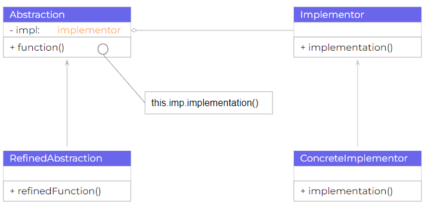

# Estructura Básica
## Elementos participantes
* Abstraction: 
    - Se define una interfaz abstracta 
    - Posee una referencia a un objeto de tipo Implementor. 
* RefinedAbstraction: 
    - Extiende la interfaz definida por Abstraction.
* Implementor:
    - Se define la interfaz para poder implementar las clases
    - No es necesario que corresponda directamente con la interfaz abstraction, de hecho pueden ser distintas.
    - Normalmente solo provee operaciones primitivas.
    - La clase Abstraction define operaciones de alto nivel basadas en dichas primitivas.
* ConcreteImplementor: 
    - Implementa la interfaz Implementor.
    - Define una implementación concreta.

(Sandra, A  y Perez, V, 2007, p.60)

Para ver un ejemplo más concreto vea [problema](./Problema.md) y [solución](./Solucion.md)

[Regresar al Readme](./../README.md)